# Product Requirements Document — PPOB2 Platform

## 1. Document Control

| Field | Value |
|---|---|
| Document Title | PRD — PPOB2 Platform (Backend-First, Future Web/Mobile Ready) |
| Document Type | Production-grade Product Requirements Document |
| Version | 1.0 (Draft for Review) |
| Status | Draft — pending Phase 0 contract/regulatory validation |
| Owner | Product Owner / Project Owner (PPOB2) |
| Prepared By | Combined Business Analyst / System Analyst / Solution Architect / Backend / DBA / DevOps / Security / Finance / QA function |
| Audience | Business stakeholders, System Analysts, Software Engineers (Java/Rust), QA, DevOps/SRE, Finance/Reconciliation, Security, Operations |
| Classification | Internal — Confidential |
| Last Updated | 2026-09-12 |

### 1.1 Revision History

| Version | Date | Author | Description |
|---|---|---|---|
| 0.1 | 2026-09-12 | Combined authoring roles | Initial full-draft PRD generated from Master Prompt |
| 0.2 | 2026-09-14 | Combined authoring roles | Added per-partner settlement allocation (BR-REC-002, FR-REC-004, Section 22.28, 37.3, 41.8, Risk Register, EPIC-06.4) — closes a gap identified when the platform's downstream reseller topology grew beyond a single partner (PPOB1) to include externally-owned reseller entities requiring their own attributable settlement figures |

### 1.2 How to Read This Document

This PRD is written to be decomposable into: Business Requirements, Functional Requirements, System Requirements, Architecture, API Contracts, Database Schema, Module Design, Backend Implementation Tasks, Admin/Backoffice specs, Batch/Decomposition Engine specs, Security Requirements, Test Cases, Performance Test Plans, Deployment Plans, Monitoring specs, Reconciliation procedures, Development Backlog, and a Production Readiness Checklist. Every business rule carries a traceable ID (`BR-xxx-nnn`) referenced later in the Requirement Traceability Matrix (Section 61).

Anything commercial, contractual, or regulatory (payment MDR, settlement schedule, provider contracts) is explicitly flagged **"Must be verified against latest contract and applicable regulation before production."** and MUST NOT be treated as hard-coded truth.

---

## 2. Executive Summary

**PPOB2** is a payment, transaction orchestration, decomposition, fulfillment, and provider integration platform. It is being built to receive digital-goods top-up transactions (starting with mobile game vouchers), collect payment via QRIS Dynamic (through Ayolinx as Payment Gateway, acquired by Bank Neo Commerce), decompose the paid parent amount into a combination of provider-purchasable SKUs ("decomposition patterns"), route the fulfillment to the most appropriate provider(s), execute fulfillment, and reconcile the full financial lifecycle (payment → provider cost → settlement → ledger).

The **first channel** consuming PPOB2 is **PPOB1**, an already-production reseller/customer-facing application that is out of scope for this PRD. However, PPOB2's architecture, APIs, and data model MUST be **channel-agnostic** from day one — designed so that a future PPOB2 Web App, Android App, iOS App, and additional partner/reseller channels can be onboarded onto the **same core transaction engine** without redesigning it.

The MVP delivery consists of exactly three mandatory components:

1. **PPOB2 Core Backend** (Java 21+, Spring Boot, Modular Monolith, PostgreSQL, Redis)
2. **PPOB2 Admin/Backoffice Web** (mandatory operational interface — no direct SQL/Postman as a normal operating procedure)
3. **Offline Decomposition Engine** (Rust, batch/offline pattern generation and daily re-scoring)

Customer-facing Web/Mobile applications are explicitly **out of scope for MVP** but are architected for in every layer (order source, channel context, identity foundation, API design).

This document is intentionally exhaustive: it is meant to be handed directly to engineering, QA, DevOps, finance, and security teams as the single source of truth for design and build.

---

## 3. Product Vision

PPOB2's vision is to become an **independent, channel-agnostic transaction orchestration platform** for digital goods (starting with game top-ups, expandable to other PPOB — Payment Point Online Bank — verticals: pulsa, data, PLN, e-money, etc. in future roadmaps not covered by this MVP).

Core vision pillars:

1. **Channel-agnosticism** — Any source of transaction (reseller API, own web/mobile app, partner API, admin-initiated) enters the same `OrderApplicationService` with a `ChannelContext`. No channel-specific business logic branches deep in the domain layer.
2. **Decomposition as a first-class capability** — The ability to satisfy an arbitrary "parent amount" using a combination of fixed-denomination provider SKUs is a core, reusable engine — not a one-off script.
3. **Economics-aware routing** — Every fulfillment decision is evaluated against margin, provider health, quota, and capacity — never a fixed/static mapping.
4. **Financial integrity and auditability** — Every rupiah is traceable end-to-end: source channel → parent order → payment → decomposition pattern → child order → provider transaction → ledger → settlement → reconciliation.
5. **Operational independence from engineering** — Business/Ops/Finance/CS teams operate the platform through the Admin Web, not through engineers running scripts or SQL.
6. **Future-proof, not future-built** — Web/Mobile/Partner channels are *designed for* now and *built later*, avoiding a costly re-architecture.

---

## 4. Background

Currently, digital-goods top-up transactions are served by **PPOB1**, a reseller/customer-facing application that is already in production and explicitly out of scope for this PRD. PPOB1 handles the customer relationship, UI/UX, pricing display to end resellers, and passes transactions to PPOB2 via an Open API.

PPOB2 today (pre-this-initiative) does not exist as a coherent, production-grade platform with the required capabilities (decomposition engine, margin engine, routing, reconciliation, admin backoffice). This PRD defines the ground-up build of PPOB2 as such a platform, using PPOB1 as the first and currently only channel, while explicitly preventing any PPOB1-specific coupling in the core.

The business driver for **decomposition** is that upstream game/digital-goods providers only sell a limited, fixed set of denominations (SKUs) per product, while PPOB1 (and future channels) want to offer a much finer-grained, configurable set of "parent amounts" to end customers. PPOB2 bridges this gap by finding valid combinations ("patterns") of provider SKUs whose combined face value exactly equals a requested parent amount, and by choosing the most profitable/healthy pattern and provider combination available at transaction time.

---

## 5. Business Objectives

| ID | Objective | Success Metric |
|---|---|---|
| OBJ-01 | Provide a reliable, channel-agnostic transaction backend for digital goods top-up | 100% of PPOB1 transaction volume served without channel-specific hacks |
| OBJ-02 | Enable configurable parent-amount offerings without being limited to raw provider SKU denominations | ≥95% of configured supported amounts have ≥1 valid decomposition pattern at all times |
| OBJ-03 | Maximize net contribution margin per transaction via economics-aware routing | Positive net_contribution on ≥98% of transactions (flagged/alerted otherwise) |
| OBJ-04 | Eliminate manual/unaudited operational intervention | 0 direct-SQL or Postman-based production mutations; 100% manual actions logged & authorized |
| OBJ-05 | Guarantee financial traceability and reconciliation | 100% of parent orders traceable end-to-end; reconciliation discrepancy resolution SLA met |
| OBJ-06 | Architect for multi-channel future without core rebuild | 0 required core-domain changes when onboarding Web/Mobile/Partner channels (only new adapters/API) |
| OBJ-07 | Production-grade non-functional posture (availability, latency, security) | Meets NFR targets in Section 16 |

---

## 6. Current Scope (MVP)

### 6.1 Mandatory — PPOB2 Core Backend

Handles: Open API, Order Management, Payment Integration (Ayolinx/QRIS), Product Catalog, Provider Integration, Decomposition Engine (consumer of offline-generated patterns), Pricing, Margin Calculation, Pattern Routing, Quota, Fulfillment, Ledger, Settlement, Reconciliation, Audit, Configuration, Notification foundation, Operational controls.

### 6.2 Mandatory — PPOB2 Admin/Backoffice Web

Mandatory operational interface for Operations, Customer Service, Finance, Reconciliation, Product, Technical Support, and Authorized Administrators. Replaces direct SQL/Postman as the normal operating interface. Full functional spec in Section 40.

### 6.3 Mandatory — Offline Decomposition Engine

Batch/offline engine (Rust preferred) that generates decomposition patterns and performs daily recalculation/scoring, decoupled from the online transaction path. Full spec in Sections 28–29.

---

## 7. Future Scope

The following are **explicitly planned but not built in MVP**. The backend MUST be designed so these can be added without core rework:

1. PPOB2 Customer Web Application (Section 59)
2. PPOB2 Android Application (Section 60)
3. PPOB2 iOS Application (Section 60)
4. Additional Partner/Reseller channels via Partner API
5. Internal/Admin-initiated transactions (where business rules permit)
6. Future PPOB verticals beyond game top-up (pulsa, data package, PLN token, e-money — noted here as roadmap context, not designed in detail in this document)
7. API Gateway introduction once multiple public-facing channels exist (Section 66 discussion)

A dedicated section, **"Future Customer Channel Architecture"**, is provided (Section 59–60) describing how Web/Mobile will consume the same backend.

---

## 8. Out of Scope for MVP

- PPOB2 Customer Web App (build)
- PPOB2 Android App (build)
- PPOB2 iOS App (build)
- API Gateway (evaluated, not mandatory infra for MVP — Section 66)
- Full customer identity/authentication system (foundation only — Section 58)
- Non-game PPOB verticals (pulsa, PLN, data package, e-money)
- Multi-currency support (assume IDR only)
- Tax engine / accounting general ledger integration (ledger here is operational/financial sub-ledger, not statutory GL)

No PPOB1-specific business logic may be hard-coded into the core in a way that would block adding another channel later (see Section 18, Channel-Agnostic Core).

---

## 9. Stakeholders

| Role | Responsibility | Primary Interest |
|---|---|---|
| Project Owner / Product Owner | Overall product direction, prioritization | Business value delivery, roadmap |
| Business Analyst | Requirement elicitation, business rule definition | Correctness of business rules |
| System Analyst | Functional/system requirement translation | Requirement completeness/consistency |
| Solution Architect | End-to-end architecture, module boundaries | Scalability, maintainability |
| Backend Engineering (Java) | Core backend, Admin backend, Open API | Implementability, code quality |
| Rust Engineering | Offline Decomposition Engine | Performance, correctness of generation |
| DBA / Database Architect | Schema design, indexing, growth planning | Data integrity, performance |
| DevOps / SRE | CI/CD, environments, observability, incident response | Deployability, reliability |
| Security Engineer | AuthN/AuthZ, secrets, signature/HMAC, PCI-adjacent controls | Attack surface minimization |
| Finance / Reconciliation Analyst | Ledger, settlement, reconciliation, margin | Financial accuracy |
| QA Engineer | Test strategy and execution across all layers | Defect prevention |
| Operations | Day-to-day monitoring, retries, investigations | Operational usability |
| Customer Service | Transaction lookup, issue investigation | Visibility, drill-down tooling |
| PPOB1 (external stakeholder) | First channel/reseller | API stability, correctness, uptime |
| Payment Gateway (Ayolinx) | Payment processing partner | Contractual/technical integration |
| Digital Goods Providers | Fulfillment partners | API/SLA/contract adherence |
| Compliance / Legal (future) | Regulatory, AML, payment services regulation | Non-evasion, auditability |

---

## 10. Assumptions

| ID | Assumption | Verification Needed |
|---|---|---|
| AS-01 | Payment Gateway = Ayolinx; Payment Method = QRIS Dynamic; Acquirer = Bank Neo Commerce | **Confirmed 2026-09-14** against Ayolinx's sandbox: a real `POST /api/v1/orders` call returned a genuine EMV/QRIS payload carrying `ID.CO.BANKNEOCOMMERCE.WWW` acquirer data — the PG/acquirer identity is no longer an assumption. Commercial terms (MDR, settlement schedule) are separate and still unconfirmed. |
| AS-02 | QRIS nominal maximum = Rp10,000,000 per transaction | Yes — regulation may change |
| AS-03 | Initial traffic ≈ 4,000 transactions/day | Yes — actual PPOB1 volume |
| AS-04 | Supported parent amounts ≈ 118 amounts (from tiered step configuration, Section 21) | Derived, configurable |
| AS-05 | Target ≤10,000 valid patterns per supported amount (≈1.18M patterns total) is an *initial operational target*, not an absolute requirement | N/A — explicitly soft target |
| AS-06 | ≥10 example digital products (Mobile Legends, Free Fire, PUBG Mobile, Honor of Kings, COD Mobile, Genshin Impact, Valorant, Arena of Valor, Clash of Clans, Undawn), each with a variable SKU count (e.g. ML=17, FF=9) | Actual provider catalog pending |
| AS-07 | Development target environment: AMD Ryzen 5 7600 or equivalent, no GPU dependency | Infra provisioning |
| AS-08 | Provider integration model includes a prepaid/deposit balance per provider | Actual provider contracts pending |
| AS-09 | Currency is IDR only; all money values in smallest currency unit (integer Rupiah, no sub-unit) | N/A |
| AS-10 | PPOB1 is "SUDAH READY" (already production) and out of scope for this PRD | Confirmed by brief |
| AS-11 | All commercial/regulatory numbers (MDR, settlement T+N, refund policy) are placeholders pending contract | **Must be verified against latest contract and applicable regulation before production.** |

---

## 11. Definitions

See table above. Additional acronyms: **PG** = Payment Gateway, **MDR** = Merchant Discount Rate, **GMV** = Gross Merchandise Value, **RPO/RTO** = Recovery Point/Time Objective, **RBAC** = Role-Based Access Control, **SLA** = Service Level Agreement, **DP** = Decomposition Pattern.

---

## 12. Current Business Flow

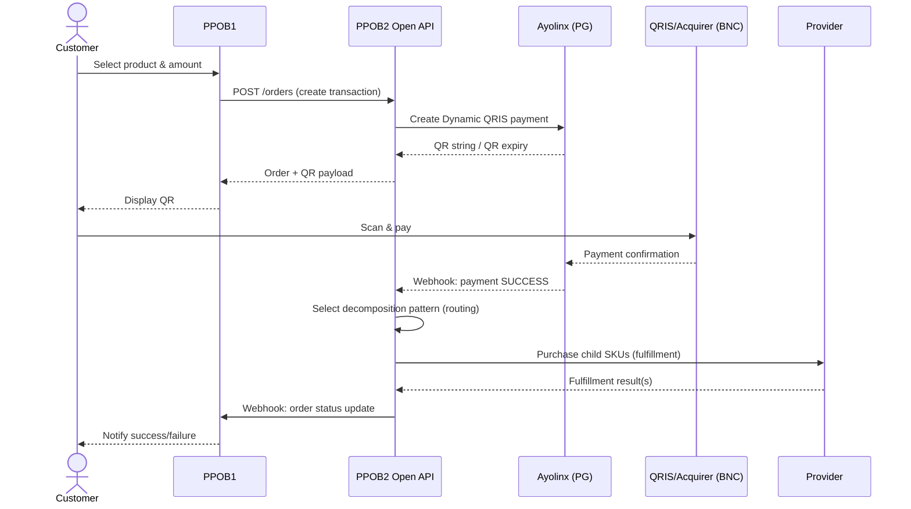

Narrative: Customer transacts inside PPOB1 (out of scope). PPOB1 calls PPOB2's Open API to create the order. PPOB2 creates a QRIS Dynamic payment via Ayolinx. The customer pays; Ayolinx/BNC confirms; PPOB2 receives an authenticated webhook; PPOB2 asynchronously selects the best decomposition pattern, executes child fulfillment against providers, and finally notifies PPOB1 (webhook and/or inquiry API), which relays the result to the customer.

---

## 13. Future Multi-Channel Business Flow

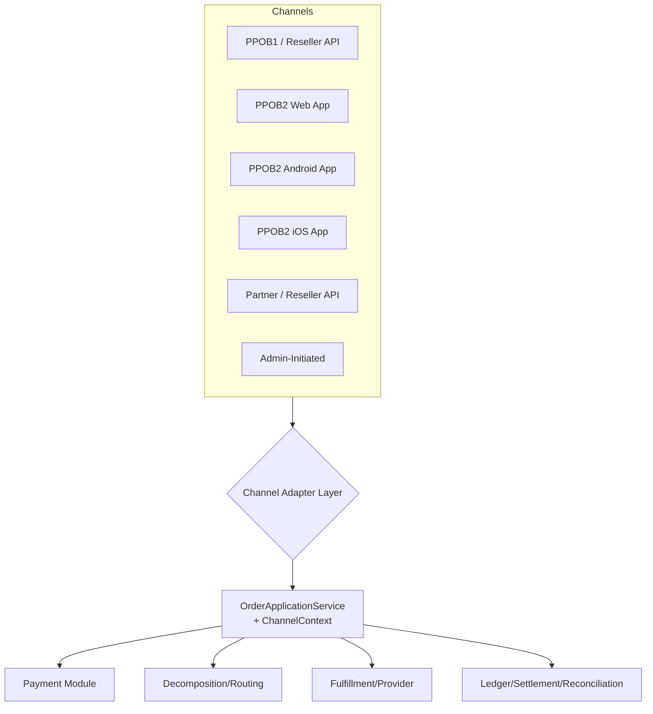

All channels converge on one `OrderApplicationService`, parameterized by a `ChannelContext` (channelType, partnerId/clientId, userId where applicable). No duplicate per-channel business services (see Section 18).

---

## 14. Business Requirements

| ID | Requirement | Priority |
|---|---|---|
| BR-BUS-001 | PPOB2 must accept orders from PPOB1 via a secured Open API | MVP Mandatory |
| BR-BUS-002 | PPOB2 must support QRIS Dynamic payment collection via Ayolinx | MVP Mandatory |
| BR-BUS-003 | PPOB2 must decompose a parent amount into valid provider SKU combinations | MVP Mandatory |
| BR-BUS-004 | PPOB2 must select the most economically/operationally optimal pattern at fulfillment time | MVP Mandatory |
| BR-BUS-005 | PPOB2 must provide an Admin/Backoffice Web for all operational needs (no direct DB/Postman ops) | MVP Mandatory |
| BR-BUS-006 | PPOB2 must maintain complete, traceable financial records (ledger, settlement, reconciliation) | MVP Mandatory |
| BR-BUS-007 | PPOB2 core must remain channel-agnostic to support future Web/Mobile/Partner channels without redesign | MVP Mandatory (architectural constraint) |
| BR-BUS-008 | PPOB2 must not implement mechanisms that conceal merchant identity, transaction source, or evade audit/AML | MVP Mandatory (compliance constraint) |
| BR-BUS-009 | Supported parent amounts must be configurable, not hard-coded, and discoverable via API | MVP Mandatory |
| BR-BUS-010 | All commercial/regulatory values (MDR, settlement schedule, refund rules) must be configuration, not code, since they may change | MVP Mandatory |

---

## 15. Functional Requirements

Functional Requirements are grouped and IDed by domain, each traceable to Business Rules, Modules, APIs, DB tables, and Test Cases in the RTM (Section 61).

### 15.1 Order Management (FR-ORD)

- **FR-ORD-001**: System shall create a Parent Order given `channel`, `partner_id`/`client_id`, `product_id`, `parent_amount`, `customer_reference` (external ref supplied by channel), and `idempotency_key`.
- **FR-ORD-002**: System shall validate `parent_amount` against the currently active `supported_amount` configuration for the requested product/category before creating an order.
- **FR-ORD-003**: System shall reject duplicate order creation requests sharing the same `idempotency_key` + `client_id` by returning the original order's result (no duplicate side effects).
- **FR-ORD-004**: System shall expose order status via `GET /orders/{id}` reflecting the current Order State Machine state (Section 27).
- **FR-ORD-005**: System shall support order cancellation only while the order is in a cancellable state (`CREATED`, `PAYMENT_PENDING`) subject to business rule.
- **FR-ORD-006**: System shall record `order_source` on every order (Section 6 taxonomy).
- **FR-ORD-007**: System shall record complete parent→child order linkage for traceability.

### 15.2 Payment (FR-PAY)

- **FR-PAY-001**: System shall create a Dynamic QRIS payment via the PaymentGateway abstraction upon order creation.
- **FR-PAY-002**: System shall set a QR expiry consistent with configuration (default proposed: 15 minutes — **must be verified**) and transition the order to `EXPIRED` if unpaid past expiry.
- **FR-PAY-003**: System shall expose payment status inquiry (`GET /orders/{id}/payment`) reflecting PG-confirmed state, not merely locally cached state, with fallback to active inquiry against PG when local state is stale beyond a threshold.
- **FR-PAY-004**: System shall receive, authenticate (HMAC/signature), de-duplicate, and process PG webhook callbacks idempotently.
- **FR-PAY-005**: System shall detect and safely ignore duplicate/replayed callbacks (Section 24).
- **FR-PAY-006**: System shall handle late callbacks (arriving after local expiry) per configured business rule (Section 24.6).
- **FR-PAY-007**: System shall support refund/reversal initiation subject to authorization and PG capability (Section 24.7).

### 15.3 Product Catalog (FR-CAT)

- **FR-CAT-001**: System shall maintain Products, each with a variable, non-hardcoded number of Provider SKUs.
- **FR-CAT-002**: System shall support enabling/disabling individual Provider SKUs without deleting historical data.
- **FR-CAT-003**: System shall version Provider pricing (`provider_price` with `effective_from`), never silently overwrite cost.
- **FR-CAT-004**: System shall expose `GET /config/supported-amounts` reflecting the current active configuration.

### 15.4 Decomposition (FR-DEC)

- **FR-DEC-001**: System shall guarantee `SUM(component_value × quantity) == parent_amount` for every pattern (hard invariant, validated at generation time and structurally at runtime).
- **FR-DEC-002**: Decomposition pattern generation (heavy computation) shall occur offline/batch, never on the synchronous transaction path.
- **FR-DEC-003**: System shall support multiple valid patterns per parent amount and select at runtime via Routing/Scoring (Section 23).
- **FR-DEC-004**: System shall invalidate affected patterns upon structural changes (SKU denomination change, SKU/product deletion, provider mapping change) and trigger partial or full regeneration as scoped (Section 20).
- **FR-DEC-005**: System shall version pattern generations (`generation_id`) and support atomic activation/rollback (Section 19).

### 15.5 Pricing & Margin (FR-PRC)

- **FR-PRC-001**: System shall compute, per pattern per day, `provider_cost_total`, `gross_profit`, `gross_margin_pct`, `payment_fee`, `net_contribution`, `net_margin_pct` (Section 22 formulas).
- **FR-PRC-002**: System shall support daily full re-scoring without requiring structural regeneration when only economics changed.
- **FR-PRC-003**: System shall flag/alert on negative-margin patterns and support excluding them from routing eligibility.

### 15.6 Routing (FR-RTE)

- **FR-RTE-001**: System shall select an eligible pattern using a configurable, weighted scoring function (Section 23).
- **FR-RTE-002**: System shall exclude ineligible patterns (disabled SKU, exhausted quota, unhealthy provider, negative margin below floor) from selection.
- **FR-RTE-003**: All scoring weights shall be configuration-driven, adjustable without code deployment.

### 15.7 Provider Integration (FR-PROV)

- **FR-PROV-001**: System shall integrate providers through a `GameProvider` abstraction supporting catalog, pricing, purchase, inquiry, and callback operations.
- **FR-PROV-002**: System shall apply timeout, retry (idempotent), circuit breaker, and rate-limiting policy per provider adapter.
- **FR-PROV-003**: System shall prevent duplicate provider purchase execution for the same child order (idempotency key to provider where supported; otherwise internal locking + inquiry-before-retry).
- **FR-PROV-004**: System shall track provider deposit/prepaid balance and alert on threshold breach (Section 26).

### 15.8 Fulfillment (FR-FUL)

- **FR-FUL-001**: System shall execute child order fulfillment with controlled concurrency (configurable max parallelism per provider).
- **FR-FUL-002**: System shall not mark a parent order `SUCCESS` unless all child orders meet the business success criteria (Section 28).
- **FR-FUL-003**: System shall support partial failure handling and compensating actions (Section 28).

### 15.9 Ledger / Settlement / Reconciliation (FR-REC)

- **FR-REC-001**: System shall record Order Ledger, Payment Ledger, Provider/Fulfillment Ledger, and Settlement Ledger as separate, append-only ledgers.
- **FR-REC-002**: System shall support reconciliation across: Payment vs PG, Payment vs Settlement, Order vs Fulfillment, Provider purchase vs Provider report, Expected vs Actual margin.
- **FR-REC-003**: System shall record and expose reconciliation discrepancies for operational resolution via Admin Web.
- **FR-REC-004**: System shall attribute each ingested settlement to the partner(s) whose payments it covers, per Section 37.3, and expose the resulting per-partner breakdown via Admin Web (Section 41.8). This is an allocation/attribution record only — it does NOT constitute or trigger a payout to the partner (Section 37.3 scope note).

### 15.10 Admin / Backoffice (FR-ADM)

- **FR-ADM-001**: System shall provide Admin Web functionality per Section 40 menu structure.
- **FR-ADM-002**: System shall enforce RBAC on all admin operations (Section 41).
- **FR-ADM-003**: System shall record all admin mutations (configuration changes, retries, manual actions) to an immutable audit log.

---

## 16. Non-Functional Requirements

All figures below are **proposed initial targets** for design and load-testing purposes; they must be validated/adjusted after Phase 0 and initial load testing.

| Category | Metric | Target |
|---|---|---|
| API Latency | p95 (Open API order create) | ≤ 300 ms (excluding PG round-trip) |
| API Latency | p99 (Open API order create) | ≤ 800 ms |
| API Latency | p95 (status/inquiry endpoints) | ≤ 150 ms |
| Availability | Core API monthly uptime | ≥ 99.9% |
| Throughput | Sustained | ≥ 50 TPS (12x average of 4,000/day ≈ 0.05 TPS baseline, sized for burst) |
| Concurrency | Peak concurrent in-flight orders | ≥ 500 |
| Data Durability | PostgreSQL | Point-in-time recovery, WAL archiving |
| RPO | Core transactional DB | ≤ 5 minutes |
| RTO | Core services | ≤ 30 minutes (Primary), ≤ 4 hours (full DR) |
| Batch SLA | Daily full re-score completion | ≤ 2 hours off-peak window |
| Batch SLA | Structural regeneration (full universe) | ≤ 6 hours (offline, non-blocking to online path) |
| Pattern Lookup Latency | Runtime routing query | ≤ 20 ms p95 (served from Redis/hot cache) |
| Provider Timeout | Per adapter call | 5–15 s configurable per provider, **must be verified per contract** |
| PG Timeout | Per Ayolinx call | 10 s configurable, **must be verified per contract** |
| Callback Processing | Webhook end-to-end ack | ≤ 500 ms (processing deferred asynchronously where heavy) |

Initial traffic assumption: **4,000 transactions/day** (~0.05 TPS average); load and stress tests must validate burst scenarios far exceeding this average (Section 55).

---

## 17. Business Rules

Business rules use the ID scheme from Section 67 of the master prompt (`BR-ORD`, `BR-PAY`, `BR-DEC`, `BR-PRC`, `BR-RTE`, `BR-PROV`, `BR-REC`, `BR-ADM`). Representative set below; full matrix cross-referenced in Section 61 (RTM).

### 17.1 Order (BR-ORD)

- **BR-ORD-001**: An order MUST NOT be created for a `parent_amount` outside the active supported-amount configuration.
- **BR-ORD-002**: Backend validation of `parent_amount` is authoritative; channel-side (e.g. PPOB1 dropdown) validation MUST NOT be trusted.
- **BR-ORD-003**: An order MUST carry a non-null `order_source` and, where applicable, `partner_id`/`client_id`.
- **BR-ORD-004**: A duplicate order create request (same `idempotency_key` + `client_id`) MUST return the original result, not create a new order.
- **BR-ORD-005**: Cancellation is only permitted in `CREATED` or `PAYMENT_PENDING` states.

### 17.2 Payment (BR-PAY)

- **BR-PAY-001**: A QRIS payment MUST NOT be created for amounts exceeding the configured QRIS maximum (baseline Rp10,000,000 — **must be verified**).
- **BR-PAY-002**: A payment callback MUST be authenticated via HMAC/signature before being trusted.
- **BR-PAY-003**: A duplicate callback (same PG transaction reference) MUST be idempotently ignored after first successful processing.
- **BR-PAY-004**: An expired QR MUST NOT be honored even if a late payment settles at the PG (route to manual review / configured refund process).
- **BR-PAY-005**: Payment SUCCESS with subsequent fulfillment failure MUST NOT silently lose the customer's paid funds — must trigger `PARTIAL_FAILED`/`FAILED` handling with defined remediation (Sections 27–28).

### 17.3 Decomposition (BR-DEC)

- **BR-DEC-001**: `SUM(component_value × quantity)` MUST equal `parent_amount` for every activated pattern — no under/over-allocation, no silent rounding.
- **BR-DEC-002**: Heavy decomposition computation MUST NOT run in the synchronous transaction path.
- **BR-DEC-003**: A structural change (denomination change, SKU/product deletion, provider mapping change) MUST invalidate affected patterns.

### 17.4 Pricing (BR-PRC)

- **BR-PRC-001**: Provider cost changes MUST be versioned with an `effective_from` timestamp; overwriting cost without history is prohibited.
- **BR-PRC-002**: Daily re-scoring MUST occur even when structure is unchanged, since provider cost/availability/quota/success-rate can change daily.

### 17.5 Routing (BR-RTE)

- **BR-RTE-001**: Routing/scoring weights MUST be configurable (not hard-coded) and audit-logged upon change.
- **BR-RTE-002**: Routing decisions MUST NOT be designed to enable audit evasion, AML evasion, transaction laundering, or concealment of merchant/transaction source.

### 17.6 Provider (BR-PROV)

- **BR-PROV-001**: Provider purchase execution MUST be idempotent; duplicate execution for the same child order is prohibited.
- **BR-PROV-002**: Provider deposit balance MUST be tracked and alerted before it reaches an operationally unsafe threshold.

### 17.7 Reconciliation (BR-REC)

- **BR-REC-001**: All five reconciliation types (Section 39) MUST be supported and discrepancies MUST be tracked to resolution.
- **BR-REC-002**: Where a settlement covers payments from more than one `partner`, the settled amount MUST be attributable back to each contributing partner (Section 37.3). The sum of all partner allocations for a settlement MUST equal `settlement.actual_amount` exactly (and, separately, allocated fees MUST sum to `settlement.fee_amount` exactly) — an allocation computation that cannot satisfy this invariant MUST be rejected, never silently rounded away. Which party bears the MDR per partner is a commercial term and **must be verified against each partner's contract** before this is treated as a fixed rule.

### 17.8 Admin (BR-ADM)

- **BR-ADM-001**: No unrestricted manual mutation of financial transaction state is permitted; all manual actions MUST be authorized, recorded, and auditable.
- **BR-ADM-002**: "Force success" on a transaction without a controlled financial procedure is prohibited.

---

## 18. Channel Architecture

### 18.1 Channel-Agnostic Core Principle

All channels (`RESELLER_API`, `PPOB2_WEB`, `PPOB2_ANDROID`, `PPOB2_IOS`, `PARTNER_API`, `ADMIN`) MUST invoke a single `OrderApplicationService`, parameterized by a `ChannelContext` value object:

```java
public record ChannelContext(
    ChannelType channelType,   // RESELLER_API, PPOB2_WEB, PPOB2_ANDROID, PPOB2_IOS, PARTNER_API, ADMIN
    String partnerId,          // nullable for consumer channels
    String clientId,           // API client credential id
    String userId,             // nullable until customer identity exists
    String applicationId,      // app/client build identifier
    String deviceSessionId     // nullable, future mobile/web session binding
) {}
```

**Anti-pattern (explicitly prohibited)**: `MobileOrderService`, `WebOrderService`, `PPOB1OrderService` each duplicating business logic. Instead: one `OrderApplicationService` + `ChannelContext`, with channel-specific concerns (auth mechanism, request/response shape) isolated to a thin **Channel Adapter** layer (Section 33/34).

### 18.2 Order Source Taxonomy

| order_source | Description | MVP Status |
|---|---|---|
| `RESELLER_API` | PPOB1 (and future resellers) via Partner/Open API | Active (primary MVP channel) |
| `PPOB2_WEB` | Future PPOB2 customer web app | Future |
| `PPOB2_ANDROID` | Future PPOB2 Android app | Future |
| `PPOB2_IOS` | Future PPOB2 iOS app | Future |
| `PARTNER_API` | Future additional partner/reseller | Future |
| `ADMIN` | Admin-initiated transaction, where business rule permits | Reserved, gated by RBAC |

Every order additionally carries: `channel_id`, `partner_id`, `client_id`, `application_id`, and optional device/session context for future customer channels.

---

## 19. System Architecture

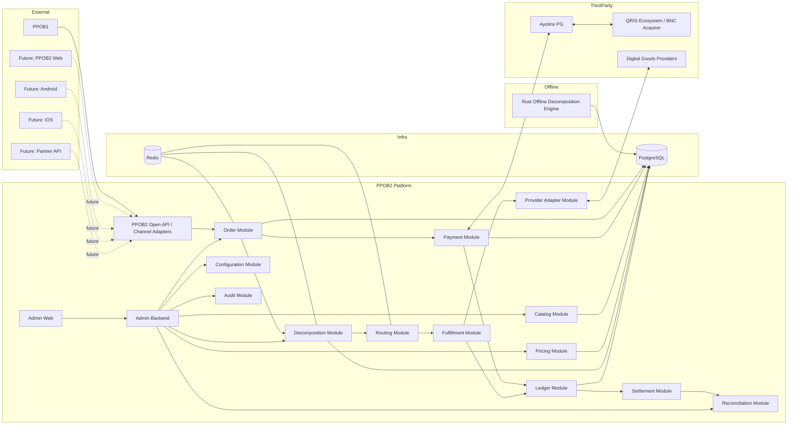

### 19.1 Architectural Style

- **Initial architecture**: Modular Monolith (Java 21+, Spring Boot) — avoids premature microservices complexity while enforcing module boundaries that make future extraction possible.
- **Database**: PostgreSQL (single primary + read replica(s) as scale requires).
- **Cache**: Redis — hot-path pattern lookup, rate limiting, idempotency key short-term cache, session/nonce store.
- **Offline compute**: Rust — CPU/memory-efficient batch decomposition and scoring, decoupled entirely from the online JVM process.
- **Messaging (Kafka/RabbitMQ)**: Evaluated, NOT introduced by default. Only adopted where a specific need for durable asynchronous messaging is proven (e.g., decoupling fulfillment execution from the payment callback handler at higher scale, or feeding a future analytics pipeline). Rationale in Section 25.3.
- **Containerization**: Docker for all services; orchestration (K8s) evaluated per environment scale — not mandated for MVP if a simpler VM/Docker Compose/ECS-style deployment suffices for initial volume.

---

## 20. Modular Architecture

### 20.1 Module List and Responsibilities

| Module | Responsibility |
|---|---|
| `channel` | Channel/partner/API-client registry, channel context resolution |
| `partner` | Partner (e.g., PPOB1) master data, credentials, contract limits |
| `order` | Parent/child order lifecycle, state machine, `OrderApplicationService` |
| `payment` | PaymentGateway abstraction, Ayolinx adapter, QRIS lifecycle |
| `catalog` | Product, Provider, Provider SKU master data |
| `pricing` | Provider price versioning, supported amount configuration, margin/economics computation |
| `decomposition` | Pattern generation orchestration (trigger/consume Rust engine output), pattern lookup, invalidation |
| `routing` | Runtime scoring and eligible-pattern selection |
| `provider` | `GameProvider` abstraction and adapters, circuit breaker, health |
| `fulfillment` | Child order execution orchestration, concurrency control, compensation |
| `ledger` | Order/Payment/Provider/Settlement ledger entries (append-only) |
| `settlement` | Settlement record ingestion and computation |
| `reconciliation` | Cross-source matching and discrepancy tracking |
| `webhook` | Inbound (PG, provider) and outbound (to PPOB1/partners) webhook handling |
| `configuration` | Central configuration store (supported amounts, weights, fees, feature flags) |
| `audit` | Immutable audit log capture across all modules |
| `admin` | Admin Web backend: auth, RBAC, all admin use cases (composes other modules, read+controlled-write) |

### 20.2 Allowed Dependencies

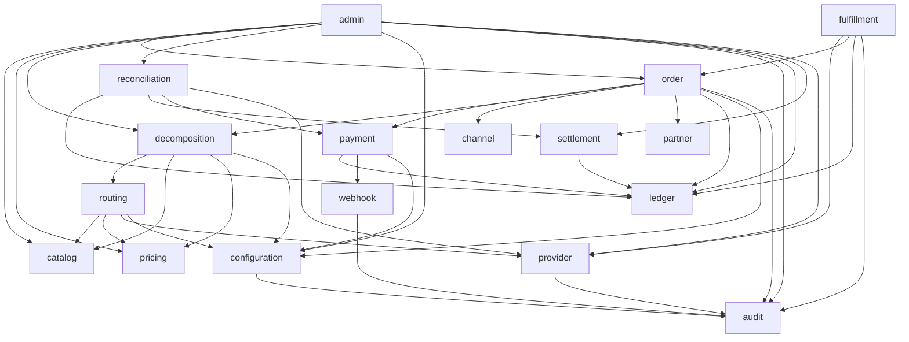

**Rule**: Lower-level modules (`catalog`, `configuration`, `audit`, `channel`, `partner`) MUST NOT depend upward on `order`, `admin`, `decomposition`, etc. `admin` is the only module allowed to depend broadly (composition root for operational use cases). No circular dependencies are permitted; enforce via build-tool module boundaries (e.g., ArchUnit tests in CI).

---

## 21. Data Architecture

### 21.1 Money Representation

**Decision**: All monetary values are stored as **integer smallest-currency-unit (IDR has no practical sub-unit in this domain)** — i.e., a Java `long`/PostgreSQL `BIGINT` representing whole Rupiah, OR `NUMERIC(18,0)` for defense against overflow at very large aggregate sums (ledger totals). Floating point (`FLOAT`/`DOUBLE`) is **prohibited** for any money field, in code and in the database, to avoid binary floating-point rounding errors in financial computation.

Recommendation: use `NUMERIC(18,0)` in PostgreSQL for all amount columns (safe headroom beyond `BIGINT` max ~9.2 quintillion, and avoids any ambiguity), and `java.math.BigInteger` or a dedicated `Money` value type (backed by `long` where volume make `BigInteger` overkill) in the Java domain layer — never `float`/`double`, never unwrapped primitive arithmetic without a `Money` wrapper enforcing currency and rounding-free operations.

### 21.2 Supported Amount Calculation

Given the tiered configuration:

- Rp10,000 – Rp100,000, step Rp10,000 → `(100,000 - 10,000)/10,000 + 1 = 10` amounts
- Rp150,000 – Rp1,000,000, step Rp50,000 → `(1,000,000 - 150,000)/50,000 + 1 = 18` amounts
- Rp1,100,000 – Rp10,000,000, step Rp100,000 → `(10,000,000 - 1,100,000)/100,000 + 1 = 90` amounts

**Total = 10 + 18 + 90 = 118 supported amounts**, matching the assumption in Section 10 (AS-04). This must be stored as **data** (`supported_amount` table, Section 22.9), not a hard-coded computation, since tiers/steps are configurable per product/category and may diverge over time.

### 21.3 Pattern Data Representation Trade-off Analysis

| Approach | Pros | Cons | Verdict |
|---|---|---|---|
| Normalized child table (`decomposition_component` rows) | Query-friendly (SQL joins/aggregation), easy reverse-index via SQL, easy partial updates | Row-count explosion (1.18M patterns × avg components could be 10M+ rows), heavier bulk-load | Good for **components that need SQL querying/reverse-index** |
| JSONB column on `decomposition_pattern` | Compact single-row read, flexible schema, fast point lookup by pattern_id | Harder to reverse-index efficiently in pure SQL, larger row size for wide patterns | Good for **fast whole-pattern retrieval** |
| Compressed binary representation (e.g., packed component array) | Smallest storage footprint, fastest bulk load via COPY, ideal for Redis caching | Requires application-side (de)serialization, not human-queryable without tooling | Good for **runtime hot-path cache** |
| **Hybrid (Recommended)** | `decomposition_pattern` stores a JSONB `components` snapshot (for fast full-pattern read) **and** a normalized `decomposition_component` table (for reverse-index/SKU-impact queries) is populated only for **active generation** patterns; Redis caches the JSONB/compressed form for hot lookup | Slight write amplification during activation | **Recommended**: gives SQL query power for impact-analysis while keeping the online hot path O(1) Redis lookups |

**Recommendation**: Use the hybrid model — `decomposition_pattern.components` as JSONB (source of truth for full pattern payload, immutable per pattern), plus a normalized `decomposition_component` table populated for reverse-index purposes (SKU → affected patterns), refreshed per generation activation. Cache serialized (compressed) pattern payloads in Redis keyed by `parent_amount` → ranked pattern list for runtime routing.

### 21.4 Reverse Index (SKU → Pattern) Evaluation

| Option | Pros | Cons |
|---|---|---|
| Relational index (`decomposition_component(base_provider_sku_id)` indexed) | Simple, transactional, consistent with normalized table | Slower for very large fan-out queries at massive scale |
| Redis Set (`sku:{id}:patterns` → set of pattern_ids) | O(1) membership, fast invalidation fan-out | Extra infra sync complexity; must rebuild on generation activation |
| Bitmap / Roaring Bitmap (pattern_id space as bitmap, one bitmap per SKU) | Extremely compact, fast set operations (union/intersect) for "which patterns touch any of these changed SKUs" | Requires bitmap library integration and ID space management |

**Recommendation**: Start with the **relational index** (adequate at 1.18M-pattern scale with a proper B-tree index on `decomposition_component(base_provider_sku_id)`); introduce a **Roaring Bitmap** cache (built once per generation, refreshed on activation, stored e.g. in Redis or as a Rust-engine side artifact) if/when reverse-index query latency becomes a bottleneck. This keeps MVP simple while leaving a clear scaling path.

---

## 22. Database Design

PostgreSQL is the system of record. Below is the full logical schema. All money columns use `NUMERIC(18,0)` (IDR whole-Rupiah). All primary keys use `BIGINT GENERATED ALWAYS AS IDENTITY` unless a natural/UUID key is specified. All tables include `created_at TIMESTAMPTZ NOT NULL DEFAULT now()` and `updated_at TIMESTAMPTZ NOT NULL DEFAULT now()` (trigger-maintained) unless noted.

### 22.1 `channel`

| Column | Type | Constraint | Purpose |
|---|---|---|---|
| id | BIGINT | PK | Surrogate key |
| code | VARCHAR(32) | UNIQUE NOT NULL | e.g. RESELLER_API, PPOB2_WEB |
| name | VARCHAR(128) | NOT NULL | Display name |
| status | VARCHAR(16) | NOT NULL DEFAULT 'ACTIVE' | ACTIVE/DISABLED |

Index: `channel_code_uk` (unique on code).

### 22.2 `partner`

| Column | Type | Constraint | Purpose |
|---|---|---|---|
| id | BIGINT | PK | Surrogate key |
| code | VARCHAR(64) | UNIQUE NOT NULL | e.g. PPOB1 |
| name | VARCHAR(255) | NOT NULL | Legal/display name |
| channel_id | BIGINT | FK → channel.id | Default channel association |
| status | VARCHAR(16) | NOT NULL DEFAULT 'ACTIVE' | ACTIVE/SUSPENDED |
| contract_ref | VARCHAR(128) | NULL | External contract reference |

Index: `partner_code_uk` (unique).

### 22.3 `api_client`

| Column | Type | Constraint | Purpose |
|---|---|---|---|
| id | BIGINT | PK | Surrogate key |
| client_id | VARCHAR(64) | UNIQUE NOT NULL | Public client identifier |
| partner_id | BIGINT | FK → partner.id NOT NULL | Owning partner |
| secret_hash | VARCHAR(255) | NOT NULL | Hashed HMAC secret (never store plaintext) |
| status | VARCHAR(16) | NOT NULL DEFAULT 'ACTIVE' | ACTIVE/REVOKED |
| rate_limit_per_min | INT | NOT NULL DEFAULT 600 | Per-client rate limit |
| allowed_ip_cidr | TEXT | NULL | Optional IP allowlist |

Index: `api_client_client_id_uk` (unique), `api_client_partner_id_idx`.

### 22.4 `product`

| Column | Type | Constraint | Purpose |
|---|---|---|---|
| id | BIGINT | PK | Surrogate key |
| code | VARCHAR(64) | UNIQUE NOT NULL | e.g. MOBILE_LEGENDS |
| name | VARCHAR(255) | NOT NULL | Display name |
| category | VARCHAR(64) | NOT NULL | e.g. GAME_TOPUP |
| status | VARCHAR(16) | NOT NULL DEFAULT 'ACTIVE' | ACTIVE/DISABLED |

Index: `product_code_uk`.

### 22.5 `provider`

| Column | Type | Constraint | Purpose |
|---|---|---|---|
| id | BIGINT | PK | Surrogate key |
| code | VARCHAR(64) | UNIQUE NOT NULL | Provider identifier |
| name | VARCHAR(255) | NOT NULL | Display name |
| status | VARCHAR(16) | NOT NULL DEFAULT 'ACTIVE' | ACTIVE/DISABLED/DEGRADED |
| timeout_ms | INT | NOT NULL DEFAULT 8000 | Adapter timeout |
| rate_limit_per_min | INT | NULL | Provider-imposed rate limit |

Index: `provider_code_uk`.

### 22.6 `provider_sku` (Base Provider SKU)

| Column | Type | Constraint | Purpose |
|---|---|---|---|
| id | BIGINT | PK | Surrogate key |
| provider_id | BIGINT | FK → provider.id NOT NULL | Owning provider |
| product_id | BIGINT | FK → product.id NOT NULL | Owning product |
| provider_sku_code | VARCHAR(64) | NOT NULL | Provider's native SKU code |
| face_value | NUMERIC(18,0) | NOT NULL | Value contribution toward parent_amount |
| status | VARCHAR(16) | NOT NULL DEFAULT 'ACTIVE' | ACTIVE/DISABLED |
| quota_daily | INT | NULL | Optional daily quota |

Index: `provider_sku_uk` UNIQUE(provider_id, provider_sku_code); `provider_sku_product_idx` on product_id.

Note: `face_value` is explicitly distinct from `provider_cost` (Section 22.7) — see Section 22.15 anti-pattern note.

### 22.7 `provider_price` (versioned provider cost)

| Column | Type | Constraint | Purpose |
|---|---|---|---|
| id | BIGINT | PK | Surrogate key |
| provider_sku_id | BIGINT | FK → provider_sku.id NOT NULL | Priced SKU |
| pricing_version | INT | NOT NULL | Monotonic version per SKU |
| provider_cost | NUMERIC(18,0) | NOT NULL | Cost PPOB2 pays provider per unit |
| effective_from | TIMESTAMPTZ | NOT NULL | Version activation time |
| effective_until | TIMESTAMPTZ | NULL | Null = currently active |

Index: `provider_price_sku_version_uk` UNIQUE(provider_sku_id, pricing_version); `provider_price_active_idx` on (provider_sku_id, effective_until) WHERE effective_until IS NULL.

### 22.8 `supported_amount`

| Column | Type | Constraint | Purpose |
|---|---|---|---|
| id | BIGINT | PK | Surrogate key |
| product_category | VARCHAR(64) | NOT NULL | Scope of applicability |
| amount | NUMERIC(18,0) | NOT NULL | Supported parent amount |
| status | VARCHAR(16) | NOT NULL DEFAULT 'ACTIVE' | ACTIVE/DISABLED |
| effective_from | TIMESTAMPTZ | NOT NULL DEFAULT now() | Activation |

Index: `supported_amount_uk` UNIQUE(product_category, amount).

### 22.9 `pattern_generation`

| Column | Type | Constraint | Purpose |
|---|---|---|---|
| id | BIGINT | PK | generation_id |
| status | VARCHAR(16) | NOT NULL | BUILDING / VALIDATING / ACTIVE / SUPERSEDED / FAILED |
| triggered_by | VARCHAR(32) | NOT NULL | SCHEDULED / MANUAL / STRUCTURAL_CHANGE |
| scope | VARCHAR(16) | NOT NULL | FULL / PARTIAL |
| started_at | TIMESTAMPTZ | NOT NULL | Start |
| completed_at | TIMESTAMPTZ | NULL | Completion |
| activated_at | TIMESTAMPTZ | NULL | When it became ACTIVE |
| pattern_count | BIGINT | NULL | Total generated |
| notes | TEXT | NULL | Free-form |

Index: `pattern_generation_status_idx`.

### 22.10 `decomposition_pattern`

| Column | Type | Constraint | Purpose |
|---|---|---|---|
| id | BIGINT | PK | pattern_id |
| generation_id | BIGINT | FK → pattern_generation.id NOT NULL | Owning generation |
| parent_amount | NUMERIC(18,0) | NOT NULL | Target amount |
| components | JSONB | NOT NULL | `[{provider_sku_id, quantity, face_value}]` snapshot |
| component_count | INT | NOT NULL | Distinct component lines |
| total_quantity | INT | NOT NULL | Sum of quantities |
| pattern_hash | CHAR(64) | NOT NULL | SHA-256 of normalized components (dedup) |
| structural_status | VARCHAR(16) | NOT NULL DEFAULT 'VALID' | VALID / INVALIDATED |

Index: `decomposition_pattern_amount_gen_idx` on (generation_id, parent_amount); `decomposition_pattern_hash_uk` UNIQUE(generation_id, pattern_hash).

### 22.11 `decomposition_component` (normalized, reverse-index support)

| Column | Type | Constraint | Purpose |
|---|---|---|---|
| id | BIGINT | PK | Surrogate key |
| pattern_id | BIGINT | FK → decomposition_pattern.id NOT NULL | Owning pattern |
| provider_sku_id | BIGINT | FK → provider_sku.id NOT NULL | Component SKU |
| quantity | INT | NOT NULL | Units of this SKU |
| face_value | NUMERIC(18,0) | NOT NULL | Snapshot of SKU face value at generation time |

Index: `decomposition_component_pattern_idx` on pattern_id; `decomposition_component_sku_idx` on provider_sku_id (reverse-index).

### 22.12 `pattern_economics` (Daily Economic Snapshot)

| Column | Type | Constraint | Purpose |
|---|---|---|---|
| id | BIGINT | PK | Surrogate key |
| pattern_id | BIGINT | FK → decomposition_pattern.id NOT NULL | Owning pattern |
| snapshot_date | DATE | NOT NULL | Economic day |
| provider_cost_total | NUMERIC(18,0) | NOT NULL | Sum(provider_cost×qty) |
| gross_profit | NUMERIC(18,0) | NOT NULL | parent_amount - provider_cost_total |
| gross_margin_pct | NUMERIC(7,4) | NOT NULL | gross_profit / parent_amount |
| payment_fee | NUMERIC(18,0) | NOT NULL | Estimated/actual PG fee |
| net_contribution | NUMERIC(18,0) | NOT NULL | gross_profit - payment_fee - direct_cost |
| net_margin_pct | NUMERIC(7,4) | NOT NULL | net_contribution / parent_amount |
| score | NUMERIC(10,4) | NOT NULL | Composite routing score |
| eligible | BOOLEAN | NOT NULL DEFAULT true | Routing eligibility flag |

Index: `pattern_economics_uk` UNIQUE(pattern_id, snapshot_date); `pattern_economics_lookup_idx` on (snapshot_date, eligible, score DESC).

### 22.13 `pattern_usage`

| Column | Type | Constraint | Purpose |
|---|---|---|---|
| id | BIGINT | PK | Surrogate key |
| pattern_id | BIGINT | FK → decomposition_pattern.id NOT NULL | Owning pattern |
| usage_date | DATE | NOT NULL | Usage day |
| daily_usage | BIGINT | NOT NULL DEFAULT 0 | Count today |
| lifetime_usage | BIGINT | NOT NULL DEFAULT 0 | Running total |

Index: `pattern_usage_uk` UNIQUE(pattern_id, usage_date).

### 22.14 `sku_usage`

| Column | Type | Constraint | Purpose |
|---|---|---|---|
| id | BIGINT | PK | Surrogate key |
| provider_sku_id | BIGINT | FK → provider_sku.id NOT NULL | Owning SKU |
| usage_date | DATE | NOT NULL | Usage day |
| daily_usage | BIGINT | NOT NULL DEFAULT 0 | Count today |
| lifetime_usage | BIGINT | NOT NULL DEFAULT 0 | Running total |
| remaining_quota | INT | NULL | Derived/cached remaining |

Index: `sku_usage_uk` UNIQUE(provider_sku_id, usage_date).

### 22.15 `parent_order`

| Column | Type | Constraint | Purpose |
|---|---|---|---|
| id | BIGINT | PK | Surrogate key |
| order_no | VARCHAR(64) | UNIQUE NOT NULL | External-facing order number |
| channel_id | BIGINT | FK → channel.id NOT NULL | Order source channel |
| partner_id | BIGINT | FK → partner.id NULL | Owning partner (nullable for consumer channels) |
| client_id | VARCHAR(64) | NOT NULL | API client used |
| user_id | VARCHAR(64) | NULL | Future customer identity |
| product_id | BIGINT | FK → product.id NOT NULL | Requested product |
| parent_amount | NUMERIC(18,0) | NOT NULL | Requested amount |
| order_source | VARCHAR(32) | NOT NULL | Taxonomy per Section 18.2 |
| idempotency_key | VARCHAR(128) | NOT NULL | Client-supplied dedup key |
| state | VARCHAR(32) | NOT NULL | Order State Machine state |
| pattern_id | BIGINT | FK → decomposition_pattern.id NULL | Selected pattern (post-routing) |
| customer_reference | VARCHAR(128) | NULL | External customer/game account ref |
| created_at | TIMESTAMPTZ | NOT NULL DEFAULT now() | |
| expires_at | TIMESTAMPTZ | NULL | Payment expiry deadline |

Index: `parent_order_idem_uk` UNIQUE(client_id, idempotency_key); `parent_order_order_no_uk` UNIQUE(order_no); `parent_order_state_idx` on state; `parent_order_created_idx` on created_at.

### 22.16 `child_order`

| Column | Type | Constraint | Purpose |
|---|---|---|---|
| id | BIGINT | PK | Surrogate key |
| parent_order_id | BIGINT | FK → parent_order.id NOT NULL | Owning parent |
| provider_sku_id | BIGINT | FK → provider_sku.id NOT NULL | Fulfilled SKU |
| quantity | INT | NOT NULL | Units to fulfill |
| sequence_no | INT | NOT NULL | Execution order within parent |
| state | VARCHAR(32) | NOT NULL | PENDING/EXECUTING/SUCCESS/FAILED/COMPENSATED |
| provider_transaction_id | BIGINT | FK → provider_transaction.id NULL | Linked provider transaction |
| attempt_count | INT | NOT NULL DEFAULT 0 | Retry count |

Index: `child_order_parent_idx` on parent_order_id; `child_order_state_idx` on state.

### 22.17 `payment`

| Column | Type | Constraint | Purpose |
|---|---|---|---|
| id | BIGINT | PK | Surrogate key |
| parent_order_id | BIGINT | FK → parent_order.id NOT NULL UNIQUE | 1:1 with parent order (MVP assumption) |
| pg_reference | VARCHAR(128) | NULL | Ayolinx transaction ref |
| method | VARCHAR(32) | NOT NULL DEFAULT 'QRIS_DYNAMIC' | Payment method |
| qr_payload | TEXT | NULL | QR string (sensitive-ish, do not over-log) |
| amount | NUMERIC(18,0) | NOT NULL | Payment amount (== parent_amount) |
| status | VARCHAR(32) | NOT NULL | PENDING/SUCCESS/FAILED/EXPIRED/REFUNDED |
| expires_at | TIMESTAMPTZ | NOT NULL | QR expiry |
| paid_at | TIMESTAMPTZ | NULL | Confirmed payment time |

Index: `payment_parent_order_uk` UNIQUE(parent_order_id); `payment_pg_reference_idx`.

### 22.18 `payment_event`

| Column | Type | Constraint | Purpose |
|---|---|---|---|
| id | BIGINT | PK | Surrogate key |
| payment_id | BIGINT | FK → payment.id NOT NULL | Owning payment |
| event_type | VARCHAR(32) | NOT NULL | CREATED/CALLBACK_RECEIVED/INQUIRY/REFUND/etc |
| raw_payload | JSONB | NOT NULL | Full PG payload for audit |
| signature_valid | BOOLEAN | NOT NULL | HMAC verification result |
| dedup_key | VARCHAR(128) | NOT NULL | For duplicate-callback detection |
| received_at | TIMESTAMPTZ | NOT NULL DEFAULT now() | |

Index: `payment_event_dedup_uk` UNIQUE(dedup_key); `payment_event_payment_idx` on payment_id.

### 22.19 `provider_transaction`

| Column | Type | Constraint | Purpose |
|---|---|---|---|
| id | BIGINT | PK | Surrogate key |
| child_order_id | BIGINT | FK → child_order.id NOT NULL | Owning child order |
| provider_id | BIGINT | FK → provider.id NOT NULL | Executing provider |
| provider_reference | VARCHAR(128) | NULL | Provider's transaction id |
| idempotency_key | VARCHAR(128) | NOT NULL | Sent to provider where supported |
| status | VARCHAR(32) | NOT NULL | PENDING/SUCCESS/FAILED/TIMEOUT/UNKNOWN |
| request_payload | JSONB | NULL | Outbound request snapshot |
| response_payload | JSONB | NULL | Inbound response snapshot |
| latency_ms | INT | NULL | Observed latency |

Index: `provider_transaction_child_idx` on child_order_id; `provider_transaction_idem_uk` UNIQUE(provider_id, idempotency_key).

### 22.20 `provider_balance`

| Column | Type | Constraint | Purpose |
|---|---|---|---|
| id | BIGINT | PK | Surrogate key |
| provider_id | BIGINT | FK → provider.id NOT NULL | Owning provider |
| balance_date | DATE | NOT NULL | Ledger day |
| opening_balance | NUMERIC(18,0) | NOT NULL | Start of day |
| topup_amount | NUMERIC(18,0) | NOT NULL DEFAULT 0 | Deposits added |
| purchase_debit | NUMERIC(18,0) | NOT NULL DEFAULT 0 | Debited via purchases |
| adjustment | NUMERIC(18,0) | NOT NULL DEFAULT 0 | Manual/reconciliation adjustment |
| closing_balance | NUMERIC(18,0) | NOT NULL | Computed EOD |
| expected_balance | NUMERIC(18,0) | NULL | Expected per internal ledger |
| actual_balance | NUMERIC(18,0) | NULL | Reported by provider |

Index: `provider_balance_uk` UNIQUE(provider_id, balance_date).

### 22.21 `ledger_entry`

| Column | Type | Constraint | Purpose |
|---|---|---|---|
| id | BIGINT | PK | Surrogate key |
| ledger_type | VARCHAR(16) | NOT NULL | ORDER / PAYMENT / PROVIDER / SETTLEMENT |
| reference_type | VARCHAR(32) | NOT NULL | e.g. PARENT_ORDER, PAYMENT, PROVIDER_TXN |
| reference_id | BIGINT | NOT NULL | FK-by-convention to referenced entity |
| entry_type | VARCHAR(16) | NOT NULL | DEBIT / CREDIT |
| amount | NUMERIC(18,0) | NOT NULL | Amount (always positive; sign via entry_type) |
| currency | CHAR(3) | NOT NULL DEFAULT 'IDR' | Currency code |
| description | VARCHAR(255) | NULL | Human-readable |
| posted_at | TIMESTAMPTZ | NOT NULL DEFAULT now() | Immutable posting time |

Index: `ledger_entry_ref_idx` on (reference_type, reference_id); `ledger_entry_type_idx` on ledger_type. **Append-only — no UPDATE/DELETE permitted at application level (enforce via DB role privileges / triggers).**

### 22.22 `settlement`

| Column | Type | Constraint | Purpose |
|---|---|---|---|
| id | BIGINT | PK | Surrogate key |
| settlement_date | DATE | NOT NULL | Settlement batch date |
| pg_reference | VARCHAR(128) | NULL | Ayolinx settlement batch ref |
| expected_amount | NUMERIC(18,0) | NOT NULL | Computed from payments |
| actual_amount | NUMERIC(18,0) | NULL | Reported by PG |
| fee_amount | NUMERIC(18,0) | NULL | PG fee deducted |
| status | VARCHAR(16) | NOT NULL | PENDING/MATCHED/DISCREPANCY |

Index: `settlement_date_idx`.

### 22.23 `reconciliation`

| Column | Type | Constraint | Purpose |
|---|---|---|---|
| id | BIGINT | PK | Surrogate key |
| recon_type | VARCHAR(32) | NOT NULL | PAYMENT_VS_PG / PAYMENT_VS_SETTLEMENT / ORDER_VS_FULFILLMENT / PROVIDER_VS_REPORT / MARGIN_EXPECTED_VS_ACTUAL |
| recon_date | DATE | NOT NULL | Batch date |
| reference_id | BIGINT | NULL | Related entity |
| expected_value | NUMERIC(18,0) | NULL | Expected |
| actual_value | NUMERIC(18,0) | NULL | Actual |
| discrepancy | NUMERIC(18,0) | NULL | actual - expected |
| status | VARCHAR(16) | NOT NULL DEFAULT 'OPEN' | OPEN/INVESTIGATING/RESOLVED |
| resolved_by | BIGINT | FK → admin_user.id NULL | Resolver |
| resolved_at | TIMESTAMPTZ | NULL | Resolution time |

Index: `reconciliation_type_date_idx`.

### 22.24 `webhook_event`

| Column | Type | Constraint | Purpose |
|---|---|---|---|
| id | BIGINT | PK | Surrogate key |
| direction | VARCHAR(8) | NOT NULL | INBOUND / OUTBOUND |
| source | VARCHAR(32) | NOT NULL | AYOLINX / PROVIDER_x / PPOB1 |
| event_type | VARCHAR(64) | NOT NULL | Event classification |
| payload | JSONB | NOT NULL | Full payload |
| status | VARCHAR(16) | NOT NULL | RECEIVED/PROCESSED/FAILED/SENT/ACKED |
| dedup_key | VARCHAR(128) | NULL | Idempotency support |

Index: `webhook_event_dedup_idx`.

### 22.25 `configuration`

| Column | Type | Constraint | Purpose |
|---|---|---|---|
| id | BIGINT | PK | Surrogate key |
| config_key | VARCHAR(128) | UNIQUE NOT NULL | e.g. `routing.weight.margin` |
| config_value | JSONB | NOT NULL | Value (typed at application layer) |
| description | VARCHAR(255) | NULL | |
| updated_by | BIGINT | FK → admin_user.id NULL | Last editor |

Index: `configuration_key_uk`.

### 22.26 `admin_user`, `role`, `permission`

| Table | Key Columns |
|---|---|
| `admin_user` | id PK, username UNIQUE, password_hash, mfa_enabled BOOLEAN, status, last_login_at |
| `role` | id PK, code UNIQUE (SUPER_ADMIN, OPERATIONS, CUSTOMER_SERVICE, FINANCE, RECONCILIATION, TECH_SUPPORT, VIEWER) |
| `permission` | id PK, code UNIQUE (e.g. `order:view`, `config:edit`, `retry:execute`) |
| `admin_user_role` | admin_user_id FK, role_id FK — composite PK |
| `role_permission` | role_id FK, permission_id FK — composite PK |

### 22.27 `audit_log`

| Column | Type | Constraint | Purpose |
|---|---|---|---|
| id | BIGINT | PK | Surrogate key |
| actor_type | VARCHAR(16) | NOT NULL | ADMIN_USER / SYSTEM |
| actor_id | BIGINT | NULL | admin_user.id if applicable |
| action | VARCHAR(64) | NOT NULL | e.g. CONFIG_UPDATE, RETRY_TRIGGERED |
| target_type | VARCHAR(64) | NOT NULL | Affected entity type |
| target_id | BIGINT | NULL | Affected entity id |
| before_state | JSONB | NULL | Snapshot before |
| after_state | JSONB | NULL | Snapshot after |
| ip_address | VARCHAR(64) | NULL | Actor IP |
| occurred_at | TIMESTAMPTZ | NOT NULL DEFAULT now() | Immutable |

Index: `audit_log_actor_idx`, `audit_log_target_idx`, `audit_log_occurred_idx`. **Append-only.**

### 22.28 `settlement_partner_allocation`

Records how one `settlement` (Section 22.22, always platform-aggregate — Ayolinx settles one figure per date, with no partner awareness) is attributed back across the partner(s) whose payments contributed to it. This is a computed **allocation** record, not a payout instruction — see Section 37.3 for the distinction and the full attribution methodology.

| Column | Type | Constraint | Purpose |
|---|---|---|---|
| id | BIGINT | PK | Surrogate key |
| settlement_id | BIGINT | FK → settlement.id NOT NULL | Parent settlement batch |
| partner_id | BIGINT | FK → partner.id NOT NULL | Attributed partner |
| gross_amount | NUMERIC(18,0) | NOT NULL | This partner's share of `settlement.actual_amount` |
| fee_allocated | NUMERIC(18,0) | NOT NULL | This partner's share of `settlement.fee_amount` |
| net_amount | NUMERIC(18,0) | NOT NULL | `gross_amount - fee_allocated` (defense-in-depth: stored, not solely derived — see Section 37.3's reconciliation-invariant discussion for why a stored, checked value is preferred over a value trusted to always be recomputed identically) |
| allocation_method | VARCHAR(16) | NOT NULL | `EXACT` (per-transaction settlement lines available) or `PRO_RATA` (batch-total only, apportioned by each partner's share of `expected_amount`) — Section 37.3 |
| computed_at | TIMESTAMPTZ | NOT NULL DEFAULT now() | When this allocation was computed |

Index: `settlement_partner_allocation_settlement_idx` on `settlement_id`; `UNIQUE(settlement_id, partner_id)` (`settlement_partner_allocation_uk`) — at most one allocation row per partner per settlement, re-computation replaces rather than duplicates.

Invariant (enforced at write time by `SettlementAllocationService`, not by a DB constraint alone, since it is a cross-row sum rather than a single-row check): for a given `settlement_id`, `SUM(gross_amount) = settlement.actual_amount` and `SUM(fee_allocated) = settlement.fee_amount`, exactly — see BR-REC-002.

---

## 23. Open API (PPOB1 / Partner → PPOB2)

### 23.1 API Design Principles

- REST/JSON over HTTPS (TLS 1.2+ mandatory), versioned via URL path (`/api/v1/...`).
- Authentication: **Client Credential (`client_id`) + HMAC-SHA256 signature** over a canonical request string, plus **timestamp** and **nonce** for replay protection.
- **Idempotency-Key** header required on all mutating (`POST`) requests.
- **Correlation-Id** header (or generated server-side and echoed) for cross-system tracing.
- Standard error envelope, standard HTTP status code mapping.
- Rate limiting per `client_id` (default 600 req/min — configurable, **must be verified against partner contract**).

### 23.2 Authentication & Signature

Request signing (example):

```
string_to_sign = HTTP_METHOD + "\n" + PATH + "\n" + TIMESTAMP + "\n" + NONCE + "\n" + SHA256(BODY)
signature = HMAC_SHA256(client_secret, string_to_sign) → hex or base64
```

Required headers:

| Header | Description |
|---|---|
| `X-Client-Id` | Public client identifier |
| `X-Timestamp` | Unix epoch ms; requests older than ±5 minutes rejected (replay protection) |
| `X-Nonce` | Random unique value per request; server rejects duplicate nonce within the timestamp window |
| `X-Signature` | HMAC-SHA256 signature per formula above |
| `Idempotency-Key` | Required for POST; UUID recommended |
| `X-Correlation-Id` | Optional; generated if absent |

### 23.3 Endpoint: Get Supported Amounts

`GET /api/v1/config/supported-amounts?product_code=MOBILE_LEGENDS`

Response `200 OK`:
```json
{
  "product_code": "MOBILE_LEGENDS",
  "currency": "IDR",
  "amounts": [10000, 20000, 30000, 40000, 50000, 60000, 70000, 80000, 90000, 100000,
              150000, 200000, 250000, 300000, 350000, 400000, 450000, 500000,
              550000, 600000, 650000, 700000, 750000, 800000, 850000, 900000, 950000, 1000000,
              1100000, 1200000, "...", 10000000],
  "generated_at": "2026-09-12T03:00:00Z"
}
```

### 23.4 Endpoint: Create Order

`POST /api/v1/orders`

Request:
```json
{
  "product_code": "MOBILE_LEGENDS",
  "parent_amount": 100000,
  "customer_reference": "GAMEID-123456-(SERVER-2001)",
  "callback_url": "https://ppob1.example.com/webhooks/ppob2",
  "metadata": { "reseller_txn_id": "PPOB1-TX-98213" }
}
```

Response `201 Created`:
```json
{
  "order_id": "ORD-20260912-000123",
  "state": "PAYMENT_PENDING",
  "parent_amount": 100000,
  "payment": {
    "method": "QRIS_DYNAMIC",
    "qr_payload": "00020101021226...6304ABCD",
    "expires_at": "2026-09-12T03:15:00Z"
  },
  "correlation_id": "b3d1f9b0-...-e2",
  "created_at": "2026-09-12T03:00:00Z"
}
```

Error `409 Conflict` (idempotency conflict with different body):
```json
{ "error_code": "IDEMPOTENCY_KEY_CONFLICT", "message": "Idempotency-Key already used with a different request payload." }
```

Error `422 Unprocessable Entity` (unsupported amount):
```json
{ "error_code": "UNSUPPORTED_AMOUNT", "message": "Requested amount is not in the active supported-amount configuration.", "parent_amount": 123456 }
```

### 23.5 Endpoint: Get Order

`GET /api/v1/orders/{order_id}`

Response `200 OK`:
```json
{
  "order_id": "ORD-20260912-000123",
  "state": "SUCCESS",
  "parent_amount": 100000,
  "payment_status": "SUCCESS",
  "fulfillment_summary": { "total_child": 2, "success": 2, "failed": 0 },
  "updated_at": "2026-09-12T03:02:14Z"
}
```

### 23.6 Endpoint: Get Payment Status

`GET /api/v1/orders/{order_id}/payment`

```json
{ "order_id": "ORD-20260912-000123", "status": "SUCCESS", "paid_at": "2026-09-12T03:01:40Z", "pg_reference": "AYOLINX-REF-778812" }
```

### 23.7 Endpoint: Cancel Order

`POST /api/v1/orders/{order_id}/cancel` — only valid while order is `CREATED` or `PAYMENT_PENDING`.

Success `200 OK`: `{ "order_id": "ORD-20260912-000123", "state": "CANCELLED" }`
Error `409 Conflict`: `{ "error_code": "ORDER_NOT_CANCELLABLE", "message": "Order is no longer in a cancellable state." }`

### 23.8 Outbound Webhook: PPOB2 → PPOB1

`POST {callback_url}` (PPOB2 initiated), signed the same way (`X-Signature` computed with PPOB1's registered secret), with retry-with-backoff on non-2xx (max attempts configurable, e.g., 5 attempts over 24h) and eventual fallback to inquiry-only if all retries exhausted.

```json
{
  "event_type": "ORDER_STATUS_CHANGED",
  "order_id": "ORD-20260912-000123",
  "state": "SUCCESS",
  "timestamp": "2026-09-12T03:02:14Z",
  "nonce": "6cf9a...",
  "signature_note": "See X-Signature header"
}
```

### 23.9 Standard Error Codes

| HTTP Status | error_code | Meaning |
|---|---|---|
| 400 | `VALIDATION_ERROR` | Malformed/missing fields |
| 401 | `SIGNATURE_INVALID` | HMAC verification failed |
| 401 | `TIMESTAMP_OUT_OF_RANGE` | Replay protection triggered |
| 403 | `CLIENT_SUSPENDED` | api_client status not ACTIVE |
| 404 | `ORDER_NOT_FOUND` | Unknown order_id |
| 409 | `IDEMPOTENCY_KEY_CONFLICT` | Same key, different payload |
| 409 | `ORDER_NOT_CANCELLABLE` | Invalid state transition |
| 422 | `UNSUPPORTED_AMOUNT` | Amount not in active config |
| 429 | `RATE_LIMITED` | Client exceeded rate limit |
| 500 | `INTERNAL_ERROR` | Unexpected server error |
| 503 | `PG_UNAVAILABLE` | Payment gateway unreachable |

### 23.10 Timeout / Retry / Versioning

- Server-side request timeout budget: 10s for order creation (excludes async fulfillment).
- Client-side (partner) retry guidance: idempotent GETs freely retryable; POST retries MUST reuse the same `Idempotency-Key`.
- API versioning via URL path; breaking changes require a new `/api/v2/` path; additive/backward-compatible changes may ship within `v1`.

---

## 24. Future Customer API

### 24.1 Partner API vs Future Customer API

| Aspect | Partner API (current) | Future Customer API |
|---|---|---|
| Authentication | Client credential + HMAC | User token / session (OAuth2-like: e.g. PKCE for mobile, session cookie/JWT for web) |
| Identity | Represents a partner/reseller (no end-customer identity in PPOB2) | Represents an actual PPOB2 customer account |
| Rate limiting | Per client_id, higher volume | Per user, lower volume, stricter abuse controls |
| Channel context | `partnerId` + `clientId` populated, `userId` null | `userId` populated, `partnerId` null |
| Core service used | `OrderApplicationService` | **Same** `OrderApplicationService` |

The **core application service and domain logic are identical** — only the authentication/channel-adapter layer differs (Section 18.1). This is the architectural guarantee that lets PPOB2 Web/Mobile be added later without core changes.

### 24.2 Anticipated Endpoints (Future, not built in MVP)

`POST /api/v1/customer/auth/login`, `POST /api/v1/customer/auth/guest-session`, `GET /api/v1/customer/orders`, `POST /api/v1/customer/orders` (thin wrapper delegating to the same order-creation use case with a customer `ChannelContext`), `GET /api/v1/customer/orders/{id}`.

---

## 25. Payment Integration

### 25.1 PaymentGateway Abstraction

```java
public interface PaymentGateway {
    PaymentCreateResult createDynamicQris(PaymentCreateRequest request);
    PaymentInquiryResult inquire(String pgReference);
    RefundResult refund(RefundRequest request);
    boolean verifyCallbackSignature(String rawBody, Map<String, String> headers);
}

public class AyolinxPaymentGateway implements PaymentGateway { /* Ayolinx-specific implementation */ }
```

Future gateways (`XenditPaymentGateway`, `MidtransPaymentGateway`, etc.) can be added by implementing `PaymentGateway` without touching `OrderApplicationService` or the Order State Machine — selection can even become configuration-driven (multi-PG routing) in a later phase.

### 25.2 Payment Flow Coverage

| Concern | Design |
|---|---|
| Create Payment | `payment` module calls `PaymentGateway.createDynamicQris()` synchronously during order creation (bounded by a short timeout; on PG timeout, order transitions to `CREATED` with a background retry rather than failing the customer-facing request outright) |
| Dynamic QRIS generation | PG returns a QR payload + PG reference; stored on `payment` |
| QR expiry | `payment.expires_at` set from configured TTL; a scheduled job (or lazy-check on read) transitions unpaid, expired payments/orders to `EXPIRED` |
| Payment inquiry | `GET` endpoint triggers local-state read; if stale beyond threshold (e.g. >30s since last event) actively calls `PaymentGateway.inquire()` |
| Payment status | Reflected in `payment.status`; drives Order State Machine transitions |
| Callback/Webhook | Inbound endpoint `POST /internal/webhooks/ayolinx` (network-restricted / IP-allowlisted where PG supports it) |
| Callback authentication | HMAC/signature verification against Ayolinx-provided secret before any processing |
| Signature verification | Reject with `401` and log to `payment_event` with `signature_valid=false` (still recorded, never processed) |
| Idempotency | `payment_event.dedup_key` (derived from PG's unique event/transaction id) enforces exactly-once processing |
| Duplicate callback | Detected via `dedup_key` unique constraint; duplicate insert conflict → acknowledge 200 without reprocessing |
| Callback ordering | Callbacks processed by comparing PG-provided event timestamp/sequence; out-of-order terminal-state callbacks (e.g. FAILED after SUCCESS) are logged and flagged for manual review, never silently overwrite a terminal SUCCESS |
| Replay protection | Timestamp window + nonce/dedup_key, same pattern as Section 23.2 |
| Late callback | If order already `EXPIRED`/`CANCELLED` and a late SUCCESS callback arrives, do NOT auto-fulfill; create a `reconciliation` (discrepancy) record and route to Admin Web for manual, audited resolution (refund or honor per SOP) |
| Settlement | Ingested from Ayolinx settlement report (Section 37) |
| Reconciliation | Section 39 |
| Refund | `PaymentGateway.refund()` — only permitted through Admin Web with authorization + audit (Section 32); subject to Ayolinx's refund capability/window, **must be verified against contract** |
| Reversal | Same controlled path as refund; distinct from refund if PG models them separately |
| Expired transaction | Order state → `EXPIRED`; no fulfillment triggered |
| Payment timeout (PG call times out during creation) | Order remains `CREATED`; background job retries QR creation or surfaces a retryable error to the channel |
| PG unavailable | Circuit breaker opens after N consecutive failures; order creation returns `503 PG_UNAVAILABLE`; alert fired |
| Payment SUCCESS but fulfillment fails | Order state machine `PARTIAL_FAILED`/`FAILED` with funds already collected — MUST NOT be silently lost; ops workflow (retry fulfillment, or refund) required — see Sections 27–28 |

#### 25.2.1 Sandbox Verification Log (2026-09-14)

Section 52's `TC-BE-001`–`TC-BE-006` (create order: supported/unsupported/over-ceiling amount,
idempotent replay, idempotency conflict) were run for real against `sandbox.ayolinx.id` with live
credentials — all five matched this section's design exactly (see `backend/README.md`'s "PRD
Section 52 order-creation test matrix" entry for the full result table).

The inbound side (`TC-BE-008`) was also exercised against a **genuine** Ayolinx-originated callback
(sandbox Demo Mode auto-completes an issued QR and calls back the registered URL) — the payload
shape, tunnel reachability, and JSON deserialization all confirmed correct against real traffic, but
**signature verification initially rejected it**. The portal-issued Ayolinx public key was confirmed
correctly loaded, ruling out a missing-credential explanation; logging the real
`X-SIGNATURE`/`X-TIMESTAMP` headers on rejection and replaying that same real signature against a
short list of candidate route strings identified the actual cause: the literal `ROUTE` this app
signs/verifies against must be **its own registered callback path**
(`/internal/webhooks/ayolinx`), not the documented `/v1/qr/qr-mpm-notify` Ayolinx-hosted path this
config used to default to. **Fixed same-day** (`callback-route`'s default corrected in
`application.yml`) and **confirmed twice against real traffic**: a fresh callback via the sandbox
portal's "Mark success" simulator, and — unprompted — Ayolinx's own webhook retry mechanism
redelivering an earlier failed callback, both now processing to `payment.status=SUCCESS` with a
ledger entry posted. Both test orders landed in `REFUND_PENDING` rather than fully fulfilled, which
is `TC-BE-018`'s own expected result (no decomposition pattern exists for the test fixture SKU), so
that row is also now confirmed for real as a side effect.

`TC-BE-012` (invalid signature) and `TC-BE-010` (duplicate callback) are also now confirmed against
the live endpoint: a garbage `X-SIGNATURE` produces `401`/`FAILED` with no state change, and an exact
replay of a real, validly-signed callback re-verifies (same bytes) but is correctly not reprocessed
— `payment_event`'s `dedup_key` unique constraint holds it to exactly one row, `payment.paid_at`
unchanged. `TC-BE-009` (failed payment callback) is confirmed as well: since the sandbox has no way
to make Ayolinx genuinely sign a failed-status callback, this used a substitute keypair (our own,
matching key held locally) as a temporary stand-in verifier against the real endpoint and a real
order — `payment.status` went to `FAILED`, the order stayed `PAYMENT_PENDING` (no transition is
defined for this case, by design), and no ledger entry was posted, exactly as expected; the app was
restarted back onto Ayolinx's real key immediately after. `TC-BE-011` (stale-timestamp replay)
remains unexercised — see `backend/README.md` for the full account and what's still open.

### 25.3 QRIS & Amount Constraints

Baseline assumption: QRIS nominal maximum **Rp10,000,000/transaction** (flagged: **must be verified against latest QRIS regulation/Ayolinx contract**). `parent_amount` validation MUST also enforce this ceiling independent of the supported-amount table (defense in depth).

---

## 26. Product Catalog

### 26.1 Example Product Set (illustrative, not exhaustive)

| Product | Example SKU Count (illustrative) |
|---|---|
| Mobile Legends | 17 |
| Free Fire | 9 |
| PUBG Mobile | (varies — not hard-coded) |
| Honor of Kings | (varies) |
| Call of Duty Mobile | (varies) |
| Genshin Impact | (varies) |
| Valorant | (varies) |
| Arena of Valor | (varies) |
| Clash of Clans | (varies) |
| Undawn | (varies) |

SKU counts are **data**, never hard-coded in application logic. Providers can add/remove/enable/disable SKUs, change `provider_cost`, availability, quota, rate limit, and — where the business model allows — denomination, all via catalog management in Admin Web (Section 40.3), each change flowing through the versioning/invalidation rules in Sections 28–29.

### 26.2 Data Model Separation (Reiterated)

`product` (game title) ≠ `provider` (upstream supplier) ≠ `provider_sku` (native denomination/SKU) ≠ `face_value`/`value contribution` ≠ `provider_cost` (versioned) ≠ `availability`/`quota`/`status`. A single ambiguous `price` field is explicitly prohibited (Section 22.6–22.7 schema separates these).

---

## 27. Provider Integration

### 27.1 GameProvider Abstraction

```java
public interface GameProvider {
    List<ProviderSkuDto> fetchCatalog();
    ProviderPriceDto fetchPricing(String providerSkuCode);
    PurchaseResult purchase(PurchaseRequest request); // must include idempotency key
    InquiryResult inquire(String providerReference);
    default void handleCallback(CallbackPayload payload) { /* optional, provider-dependent */ }
}

public class ProviderAAdapter implements GameProvider { /* ... */ }
public class ProviderBAdapter implements GameProvider { /* ... */ }
```

### 27.2 Cross-Cutting Adapter Concerns

| Concern | Design |
|---|---|
| Timeout | Per-provider configurable (`provider.timeout_ms`), default 8s |
| Retry | Idempotent-only automatic retry (max 2 additional attempts, exponential backoff), gated by circuit breaker state |
| Idempotency | `provider_transaction.idempotency_key` sent to provider where the provider API supports it; otherwise internal dedup via unique constraint + inquiry-before-retry pattern |
| Circuit Breaker | Per-provider (e.g., Resilience4j `CircuitBreaker`); opens on error-rate threshold, half-open probe, auto-recovery |
| Health Check | Scheduled lightweight ping/catalog-fetch; feeds `provider.status` (ACTIVE/DEGRADED/DOWN) consumed by Routing (Section 31) |
| Rate Limiting | Per-provider token bucket honoring `provider.rate_limit_per_min` |

### 27.3 Provider Deposit Model

See Section 37 (Provider Deposit) for the full balance-tracking design; every successful `provider_transaction` posts a `purchase_debit` against `provider_balance` for the day.

---

## 28. Decomposition Engine

### 28.1 Purpose & Terminology

The Decomposition Engine solves: *given a `parent_amount`, find one or more combinations of Base Provider SKUs (from possibly multiple providers, for the same product) whose summed face value exactly equals `parent_amount`.*

Terminology (fixed, must be used consistently across code/docs to avoid ambiguity):

- **Base Provider SKU**: the provider's native, purchasable denomination (e.g., "Provider A — ML 100 Diamonds — SKU code `MLA100`", face_value = Rp 14,000).
- **Decomposition Pattern**: a specific multiset of Base Provider SKUs (with quantities) whose summed face value equals a `parent_amount` (e.g., 2× `MLA100` (Rp14,000 each, wait — illustrative only, real face values from catalog) + 1× `MLB50000`).

### 28.2 Invariant (Hard Constraint)

```
SUM(component.face_value × component.quantity) == parent_amount   for every pattern, always.
```

No under-allocation, no over-allocation, no silent rounding, and no post-hoc amount mutation to "make it fit." This invariant is enforced (a) structurally at generation time in the Rust engine, (b) again at bulk-load validation into PostgreSQL staging (Section 44), and (c) as a runtime assertion before a pattern is ever attached to a parent order.

There is no hard mathematical limit on component count; however, the runtime scoring function applies a `child_count_penalty` (Section 31) to disincentivize patterns with excessive fragmentation, since each component becomes a separate child order/fulfillment call with its own failure surface.

### 28.3 Offline / Batch Requirement

Heavy decomposition computation (search over combinations) MUST NOT execute on the synchronous customer-facing transaction path (BR-DEC-002). It is generated **offline** by the Rust engine (Section 29) ahead of time, persisted, and merely **looked up** (O(1)/O(log n) via indexed/cached lookup) at runtime by the Routing module (Section 31).

---

## 29. Pattern Generation (Offline Decomposition Engine)

### 29.1 Technology & Target Environment

- **Language**: Rust (preferred for CPU/memory efficiency, safety without GC pauses, and easy parallelism via `rayon`).
- **Target development/runtime hardware**: AMD Ryzen 5 7600 (6-core/12-thread) or equivalent. **GPU is not a mandatory dependency** — the search space, while large, is combinatorial/integer in nature and well suited to CPU-bound DP/branch-and-bound rather than GPU parallel float math.
- Engine characteristics required: CPU-efficient, memory-efficient, parallelizable (data-parallel across parent amounts and products), deterministic/reproducible given a fixed configuration/seed (for auditability and regression testing), capable of pruning, and able to produce a **bounded set of high-quality patterns** — explicitly NOT an exhaustive enumeration of the theoretical combination space (which is intractable and mostly low-value).

### 29.2 Algorithm Study & Selection

| Algorithm | Complexity | Memory | Multiple Solutions? | Quantity Support | Scalability | Verdict |
|---|---|---|---|---|---|---|
| Classic Coin Change (min coins) | O(amount × #SKUs) | O(amount) | No (single optimal) | Yes | Good | Insufficient alone — only gives one "best" combination |
| Unbounded Knapsack DP | O(amount × #SKUs) | O(amount) | No (single) | Yes (unbounded qty) | Good | Good base for feasibility, not diversity |
| Bounded Knapsack DP | O(amount × #SKUs × maxQty) | O(amount × #SKUs) | No (single) | Yes (bounded qty, matches quota realism) | Moderate | Useful when SKU quota bounds quantity |
| K-Best Solutions (via DP + backtracking, or Lawler's/Eppstein's algorithm) | O(amount × #SKUs) + O(K log K) for extraction | O(amount × #SKUs) | **Yes — top-K distinct combinations** | Yes | Good | **Core technique for generating multiple ranked patterns per amount** |
| Branch and Bound with pruning | Exponential worst-case, but pruned in practice | O(depth) | Yes (as many as time budget allows) | Yes | Good with strong bounds | **Used to explore beyond DP's implicit ordering and apply business-rule pruning (e.g., max component count, provider diversity)** |
| Graph/State-Space Search (treat remaining-amount as state) | Equivalent to DP with different traversal | O(states) | Yes | Yes | Good | Conceptually equivalent to DP formulation used here |
| Memoization | N/A (technique, not algorithm) | Trades memory for speed | N/A | N/A | N/A | Applied throughout DP/B&B implementation |
| Parallel Search (`rayon` data-parallelism across amounts/products) | Same per-unit complexity, wall-clock reduced by core count | Same, ×parallel workers | N/A | N/A | **Essential at 118 amounts × multiple products scale** | **Adopted** — each (product, parent_amount) pair is generated independently and embarrassingly parallel |

**Selected approach**: A **DP-based unbounded/bounded knapsack formulation** (to guarantee correctness/completeness of *feasible* combinations up to the value invariant) combined with **K-Best extraction** (to yield multiple, not just one, valid combinations per amount) and a **Branch-and-Bound layer with pruning heuristics** (component-count limit, provider-diversity target, per-SKU quantity caps derived from quota) to keep the generated set both **bounded** (≤10,000 patterns/amount target) and **high quality** (favoring fewer components, diverse providers, and denominations that leave headroom for good daily economics). Parallelization is applied across the (product × parent_amount) grid using Rust's `rayon`, since each unit of work is independent.

Rationale summary:
- **Complexity**: DP layer is pseudo-polynomial in `parent_amount` (bounded ≤ Rp10,000,000) and #SKUs (bounded, small per product) — tractable.
- **Memory trade-off**: DP table sized by `parent_amount / gcd(denominations)`-ish granularity; capped by using the smallest common practical denomination step, kept per-product (not global) to bound memory.
- **CPU trade-off**: K-Best extraction and B&B pruning add overhead proportional to K and pruning depth, both bounded by configuration (target K=10,000/amount, configurable pruning depth).
- **Multiple solutions**: K-Best + B&B directly produce the ranked candidate list the business needs (rather than one "optimal" combination).
- **Quantity support**: Bounded knapsack formulation naturally supports per-SKU quantity limits from `provider_sku.quota_daily`.
- **Scalability**: Parallel-by-amount/product design scales near-linearly with core count on the target hardware; no GPU required.

### 29.3 Pattern Pool Sizing (Initial Operational Target — Not Absolute)

- Supported parent amounts ≈ **118** (Section 21.2).
- Target maximum: **≤10,000 valid patterns per supported amount**.
- Potential pattern count ceiling ≈ **1.18 million patterns** (118 × 10,000).
- This is explicitly an **initial operational target**, not a hard requirement — the generator may produce fewer patterns per amount where valid combinations do not reach 10,000 (e.g., very small amounts with few SKU denominations available).

### 29.4 Pattern Data (Minimum Fields)

Per Section 22.10–22.11 schema: `pattern_id`, `generation_id`, `parent_amount`, `components` (JSONB snapshot), `component_count`, `total_quantity`, `pattern_hash` (SHA-256 of normalized/sorted components for de-duplication within a generation), `structural_status`, `created_at`.

### 29.5 Pattern Data Representation

See Section 21.3 (Hybrid model: JSONB snapshot + normalized reverse-index table) — the Rust engine emits both a compact binary/CSV artifact for bulk load into `decomposition_component` and a JSONB-ready serialized form for `decomposition_pattern.components`.

---

## 30. Daily Economics & Re-Scoring

### 30.1 Structural Pattern vs Daily Economic Snapshot

- **Structural Pattern** (`decomposition_pattern`): the denomination/composition definition — changes only on structural events (Section 30.3).
- **Daily Economic Snapshot** (`pattern_economics`): the day's computed `provider_cost_total`, `gross_profit`, `gross_margin_pct`, `payment_fee`, `net_contribution`, `net_margin_pct`, `score`, `eligible` flag — recomputed **daily**, and potentially intra-day if a significant pricing event occurs.

If provider cost changes without any denomination change, **no structural regeneration is required** — only a re-price/re-score pass (cheap, since it is arithmetic over the existing component list, not a new combinatorial search).

### 30.2 Daily Full Re-Scoring — Why It's Needed Even Without Structural Change

Even with unchanged structure, the following can change day-to-day and must trigger a full re-score across all active patterns:

Provider cost · Provider availability · SKU usage · Pattern usage · Provider usage · Quota · Remaining capacity · Success rate · Failure rate · Average latency · Payment fee · Operational policy.

**Example**: Monday's top-ranked pattern for a given amount may differ from Tuesday's purely due to provider cost or health changes — the routing layer must reflect the latest score, and the re-score job is what keeps `pattern_economics.score`/`eligible` current for that.

### 30.3 Structural Change & Invalidation

Triggers requiring pattern invalidation: SKU denomination change, `value contribution` (face_value) change, SKU deletion, product deletion, provider mapping change.

Process:
1. Detect structural change event (via Admin Web catalog mutation or provider feed ingestion).
2. Use the **Reverse Index** (Section 30.4) to identify affected `pattern_id`s (those containing the changed `provider_sku_id`).
3. Mark affected patterns `structural_status = INVALIDATED` (never silently deleted — retained for audit/history).
4. Trigger **partial regeneration** scoped to the affected `(product, parent_amount)` pairs — **not** a full-universe regeneration — unless the change is broad enough (e.g., product deletion cascading across many amounts) to warrant a full regen.

### 30.4 Reverse Index (SKU → Pattern)

See Section 21.4 for the evaluated options and recommendation (relational index now, Roaring Bitmap as a later scaling optimization). The reverse index answers: *"Given changed `provider_sku_id`s, which `pattern_id`s are affected?"* — enabling scoped invalidation instead of full-universe regeneration (BR-DEC-003 compliance without wasteful recompute).

---

## 31. Routing & Scoring

### 31.1 Runtime Selection Flow

At fulfillment time, the Routing module selects the best **eligible** pattern for the order's `(product, parent_amount)` from the pre-generated, pre-scored, cached candidate list (Redis-backed, refreshed from `pattern_economics` + `pattern_usage`/`sku_usage` + provider health signals).

### 31.2 Eligibility Criteria (must ALL pass)

- Every component's `provider_sku.status == ACTIVE`
- Every component's provider `status != DOWN`
- SKU-level and provider-level quota not exhausted for the day
- `pattern_economics.eligible == true` (i.e., not flagged negative-margin below floor)
- Pattern `structural_status == VALID` and belongs to the currently `ACTIVE` generation

### 31.3 Scoring Formula (Configurable Weights)

```
score =
    w_margin      * margin_score
  + w_provider    * provider_health_score
  + w_availability* availability_score
  + w_capacity    * capacity_score
  + w_loadbalance * load_balance_score
  - w_childcount  * child_count_penalty
  - w_failure     * failure_penalty
```

All `w_*` weights and the normalization of each sub-score are stored in `configuration` (Section 22.25) and are adjustable via Admin Web (Section 40.9) without a code deployment (BR-RTE-001). Sub-scores are computed from: `net_contribution`/`net_margin_pct` (margin_score), provider success-rate/latency (provider_health_score), SKU/provider `status` and remaining-quota ratio (availability_score, capacity_score), recent usage distribution across eligible patterns/providers to avoid concentrating all volume on one provider (load_balance_score), `component_count` (child_count_penalty), and recent failure rate (failure_penalty).

### 31.4 Purpose of Variation (Explicitly Legitimate)

Routing variation exists to achieve: load balancing, capacity management, quota management, resiliency (avoiding single-provider concentration risk), operational performance, and economics (margin optimization) — **never** for audit evasion, AML evasion, transaction laundering, merchant identity concealment, or concealment of transaction source (BR-RTE-002, Section 50).

---

## 32. Quota & Usage

### 32.1 Usage Tracking Scope

Tracked at: pattern (`pattern_usage`), Base SKU (`sku_usage`), product (aggregatable from SKU usage), provider (aggregatable from SKU usage joined to `provider_sku.provider_id`), and channel where needed (aggregated from `parent_order.channel_id`).

Minimum fields per Section 22.13–22.14: `daily_usage`, `lifetime_usage`, and a usage window where needed (e.g., rolling 1-hour window for burst-rate limiting, distinct from the daily counter).

### 32.2 Quota & Capacity Controls

- **Daily quota** per SKU/provider (`provider_sku.quota_daily`, aggregated provider-level quota).
- **Remaining quota** computed as `quota_daily - daily_usage`, cached in Redis for O(1) eligibility checks during routing.
- **Provider limit** and **SKU limit** enforced pre-fulfillment (reject/route-around before attempting purchase, not just after failure).
- **Temporary disable** and **cooldown**: an Admin-Web-triggered or automated (e.g., after N consecutive failures) temporary disable of a SKU/provider for legitimate capacity/health management — logged to `audit_log`, never used to obscure transaction routing intent (Section 50).

---

## 33. Order State Machine

### 33.1 States

`CREATED` → `PAYMENT_PENDING` → `PAID` → `DECOMPOSITION_SELECTED` → `FULFILLING` → `SUCCESS` | `PARTIAL_FAILED` | `FAILED`, with side branches `REFUND_PENDING` → `REFUNDED`, and terminal exits `EXPIRED`, `CANCELLED`.

### 33.2 State Transition Table

| From | To | Trigger | Side Effect |
|---|---|---|---|
| — | `CREATED` | Order create request validated | Persist parent_order; emit audit |
| `CREATED` | `PAYMENT_PENDING` | PaymentGateway QR created | Persist `payment` row; return QR to channel |
| `CREATED` | `CANCELLED` | Cancel request (Section 23.7) | No payment yet created |
| `CREATED` | `EXPIRED` | PG creation failed & no retry succeeded within window | Alert, no funds involved |
| `PAYMENT_PENDING` | `PAID` | PG callback SUCCESS, signature valid, not duplicate | Ledger: payment ledger entry posted |
| `PAYMENT_PENDING` | `CANCELLED` | Cancel request before payment | No refund needed |
| `PAYMENT_PENDING` | `EXPIRED` | QR TTL elapsed, no payment received | No fulfillment triggered |
| `PAID` | `DECOMPOSITION_SELECTED` | Routing module selects eligible pattern | Pattern usage counter incremented |
| `PAID` | `REFUND_PENDING` | No eligible pattern found (BR-DEC exhaustion) | Alert Ops; queue refund |
| `DECOMPOSITION_SELECTED` | `FULFILLING` | Child orders created & dispatch begins | Child orders persisted `PENDING` |
| `FULFILLING` | `SUCCESS` | All child orders meet success criteria | Ledger: provider/fulfillment entries posted |
| `FULFILLING` | `PARTIAL_FAILED` | Some but not all child orders succeed, retries exhausted | Alert Ops; compensating workflow triggered |
| `FULFILLING` | `FAILED` | All child orders fail, retries exhausted | Queue refund/manual review |
| `PARTIAL_FAILED` | `SUCCESS` | Manual/automated retry completes remaining child orders | Requires authorized retry (Section 32/Admin) |
| `PARTIAL_FAILED` / `FAILED` | `REFUND_PENDING` | Ops decision per SOP | Authorized, audited action |
| `REFUND_PENDING` | `REFUNDED` | Refund executed via PaymentGateway | Ledger: reversing entry posted |

**Terminal states**: `SUCCESS`, `REFUNDED`, `EXPIRED`, `CANCELLED`. `FAILED` is terminal only if no refund path is pursued (otherwise transitions to `REFUND_PENDING`).

**Invalid transitions** (explicitly rejected by the state machine implementation, e.g. a Spring State Machine or an explicit guard-based transition table): any transition not listed above — e.g. `SUCCESS` → any other state (immutable once reached, corrections happen via new compensating ledger entries, never by mutating a closed order).

### 33.3 Retry Behavior

Retries apply only to `FULFILLING`/`PARTIAL_FAILED` child-order execution (idempotent, bounded attempts, Section 34) and to outbound webhook delivery (Section 23.8) — never to re-attempting a payment that already reached a terminal PG status.

---

## 34. Child Fulfillment

### 34.1 Execution Model

- **Concurrency**: controlled parallelism per parent order (configurable max concurrent child executions, default sequential-per-provider to respect `provider.rate_limit_per_min`, parallel-across-providers).
- **Provider rate limit**: enforced via a token-bucket limiter per provider adapter (Section 27.2).
- **Timeout & retry**: bounded automatic retries (default 2 additional attempts) only for idempotent-safe failure classes (timeout, 5xx); non-idempotent-safe ambiguous failures (e.g., connection reset after request sent) require an **inquiry-before-retry** step against the provider's inquiry API where available.
- **Idempotency / duplicate execution prevention**: enforced via `provider_transaction.idempotency_key` unique constraint (Section 22.19) plus a distributed lock (Redis) per `child_order_id` during execution to prevent concurrent duplicate dispatch (e.g., from a retried background job overlapping a still-in-flight attempt).
- **Partial failure**: if some child orders in a parent succeed and others fail after exhausting retries, the parent transitions to `PARTIAL_FAILED` (Section 33) — **never silently reported as SUCCESS** (BR-ORD business-success criterion: parent SUCCESS requires ALL child orders SUCCESS).
- **Compensating process**: for a `PARTIAL_FAILED` order where the failed remainder cannot be fulfilled (e.g., SKU now disabled), the compensating action is either (a) an authorized manual retry against an alternate pattern's equivalent-value substitute (rare, high scrutiny) or (b) a partial/full refund — both are explicit, authorized, audited Admin Web actions (Section 32/40.10), never automatic silent substitution.
- **Reconciliation**: every child order's final state feeds the Order vs Fulfillment reconciliation (Section 38).

---

## 35. Asynchronous Design

### 35.1 Synchronous vs Asynchronous Boundary

The customer-facing request (`POST /orders`) is synchronous only up to **QR issuance** — it does **not** wait for payment confirmation or fulfillment completion. The flow after payment confirmation (routing, fulfillment, ledger posting) is asynchronous, triggered by the payment webhook.

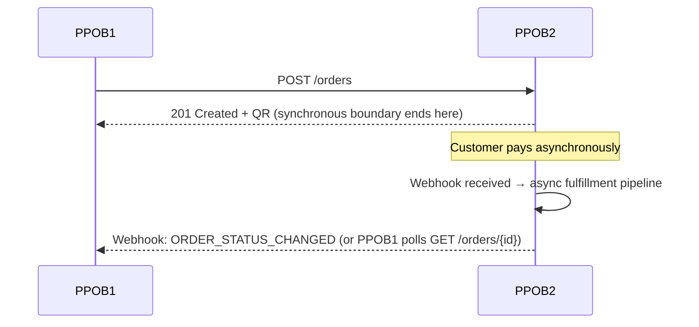

PPOB1 (and future channels) may either receive the outbound webhook (Section 23.8) or perform active status inquiry (`GET /orders/{id}`) — both are supported, and channels should treat webhook delivery as best-effort with inquiry as the reconciling fallback (webhook delivery is retried but not guaranteed exactly-once at the transport level, so the receiving side must also tolerate duplicate webhook deliveries idempotently).

---

## 36. Ledger

### 36.1 Ledger Separation

Four distinct, append-only ledgers (Section 22.21 `ledger_entry.ledger_type`):

- **Order Ledger**: entries tied to parent/child order lifecycle events (e.g., order value recognition).
- **Payment Ledger**: entries tied to payment confirmation, refund, reversal.
- **Provider/Fulfillment Ledger**: entries tied to provider purchase debits against `provider_balance`.
- **Settlement Ledger**: entries tied to funds actually settling from PG/acquirer to PPOB2's bank account.

### 36.2 Traceability Requirement

Every ledger entry carries `reference_type` + `reference_id`, enabling full reconstruction of the chain: Source Channel → Parent Order → Payment → Decomposition Pattern → Child Order → Provider Transaction → Ledger → Settlement → Reconciliation (Section 50). Ledger entries are **never updated or deleted** at the application level — corrections are made via new, clearly-referenced reversing/adjusting entries (standard double-entry-inspired discipline, even though this is an operational sub-ledger rather than a statutory general ledger — Section 22.3/62.1).

---

## 37. Settlement

### 37.1 Settlement Process

Ayolinx settles collected QRIS funds to PPOB2's bank account on a contractual schedule (**T+N — must be verified against latest Ayolinx contract**). PPOB2 ingests the settlement report (file/API, format **TBD — must be verified**) into the `settlement` table, computing `expected_amount` from the sum of `payment` records for the settlement window and comparing against the PG-reported `actual_amount` and `fee_amount` (MDR — **must be verified against contract**).

### 37.2 Settlement Fields & Discrepancy

Per Section 22.22 schema: `settlement_date`, `pg_reference`, `expected_amount`, `actual_amount`, `fee_amount`, `status` (`PENDING`/`MATCHED`/`DISCREPANCY`). A `DISCREPANCY` status automatically opens a linked `reconciliation` record (`recon_type = PAYMENT_VS_SETTLEMENT`) for Finance/Reconciliation team resolution via Admin Web (Section 40.8).

### 37.3 Per-Partner Settlement Allocation

**Why this exists**: Section 22.2/22.3 already model multiple `partner` rows (PPOB1, and any additional reseller onboarded per Section 18/24 — including reseller entities that are separately-owned businesses, not just sub-accounts of one owner). Section 37.1's settlement, however, is inherently platform-aggregate: Ayolinx settles one figure per `settlement_date` with no awareness of which of PPOB2's partners' end-customers generated it. Whenever more than one partner is active, "how much of today's settlement belongs to partner X" is a question PPOB2 must answer itself — Ayolinx cannot.

**Attribution method — branches on a fact that must be verified against the actual Ayolinx settlement report before this is finalized (same caveat as Section 37.1's format itself):**

1. **`EXACT` (preferred)** — if the Ayolinx settlement report carries per-transaction line items (not just a batch total), each settled line is matched to its originating `payment` (via `pg_reference`/PG transaction id) and attributed to that payment's `parent_order.partner_id` directly. No apportionment is needed; this is a direct join, not an estimate.
2. **`PRO_RATA` (fallback, only if the report is a batch total with no line items)** — each partner's `gross_amount` is apportioned in proportion to that partner's share of `expected_amount` (i.e., that partner's sum of `SUCCESS` payments for the settlement date, divided by the settlement's total `expected_amount`), applied to the PG-reported `actual_amount`. `fee_amount` is apportioned the same way unless the partner contract specifies a different fee-bearing arrangement (**must be verified per partner contract** — see BR-REC-002).

   Because Section 21.1 prohibits floating-point money arithmetic, pro-rata division produces integer remainders that a naive per-partner multiply-and-floor will not distribute exactly. **Largest-remainder method** is the specified rounding rule: compute each partner's raw share, floor it, then distribute the leftover units (the difference between `actual_amount` and the sum of floored shares) one unit at a time to the partners with the largest fractional remainders, until the invariant in Section 22.28 holds exactly. An allocation that cannot be made to sum exactly (e.g., due to a data inconsistency in `expected_amount`) is rejected and surfaced as an operational error, not silently forced to balance.

**Scope, held deliberately narrow**: this section covers **attribution only** — recording how much of an already-received settlement belongs to which partner, for reporting/reconciliation purposes. It does **not** cover disbursing that amount to the partner's own bank account; that is a separate, not-yet-specified payout/disbursement capability (Section 7, Future Scope candidate) with its own authorization, timing, and ledger-posting design. Conflating the two would mean an attribution computation implicitly gains money-movement authority it was never designed to carry.

**When to compute**: triggered immediately after `SettlementIngestionService.ingest` (Section 37.1) persists a `settlement` row, in the same transaction, mirroring the existing settlement→reconciliation composition pattern (Section 38.2) rather than an `AFTER_COMMIT` listener — for the same reason already established elsewhere in this codebase: there is no external I/O forcing the transaction apart, and "every settlement gets allocated" is intended as an invariant, not a best-effort side effect.

**Interaction with `DISCREPANCY`**: allocation is computed regardless of whether the parent `settlement.status` is `MATCHED` or `DISCREPANCY` — same treatment Section 37.2 already gives the Settlement Ledger posting itself (a discrepancy is about the total amount being wrong, not about whether it can be attributed). A `DISCREPANCY` settlement's allocation is therefore itself provisional and should be re-derived (replacing the existing `settlement_partner_allocation` rows for that `settlement_id`, per Section 22.28's uniqueness constraint) once the discrepancy is `RESOLVED`.

---

## 38. Reconciliation

### 38.1 Minimum Reconciliation Types

| Type | Compares | Purpose |
|---|---|---|
| Payment vs PG | Internal `payment` records vs Ayolinx transaction report | Detect missing/mismatched payment confirmations |
| Payment vs Settlement | Sum of confirmed payments vs actual bank settlement | Detect settlement shortfalls/fee discrepancies |
| Order vs Fulfillment | Parent/child order final states vs expected all-success criterion | Detect silent partial failures |
| Provider purchase vs Provider report | Internal `provider_transaction` records vs provider's own transaction/billing report | Detect provider-side discrepancies, disputed charges |
| Expected margin vs Actual margin | `pattern_economics` projected net_contribution vs actual computed post-fact from real provider cost/payment fee | Detect margin erosion, pricing drift |

### 38.2 Discrepancy Handling

Every discrepancy is persisted to `reconciliation` (Section 22.23) with `status = OPEN`, visible and actionable in Admin Web (Section 40.8), and must be moved to `INVESTIGATING` then `RESOLVED` by an authorized Finance/Reconciliation role, with `resolved_by`/`resolved_at` recorded for audit.

---

## 39. Provider Deposit

### 39.1 Prepaid/Deposit Balance Model

Many digital-goods providers operate on a **prepaid deposit** model: PPOB2 tops up a balance with the provider, and each purchase debits that balance. This is tracked per Section 22.20 `provider_balance`:

`opening_balance` → + `topup_amount` → − `purchase_debit` → ± `adjustment` → `closing_balance` (computed), compared against `expected_balance` (internal ledger projection) vs `actual_balance` (provider-reported, where the provider exposes a balance-inquiry API).

### 39.2 Threshold Alerting

An Admin-Web-configurable threshold (e.g., "alert when balance < Rp X or < N days of average daily debit") triggers an operational alert (Section 46) before the provider balance is exhausted, preventing unexpected fulfillment failures due to insufficient provider funds — this is a **capacity/operational risk control**, not a financial reporting mechanism (see Risk Register, Section 62 — "provider deposit shortage").

---

## 40. Batch Processing

### 40.1 Pattern Data Pipeline

```mermaid
flowchart LR
    A[Offline Rust Engine] --> B[Compressed Output\n(binary/CSV artifact)]
    B --> C[Secure Upload\n(TLS, checksum-verified)]
    C --> D[PostgreSQL Staging Tables]
    D --> E[Validation\n(invariant check, dedup, hash verify)]
    E --> F[Bulk Load\n(COPY into decomposition_pattern /\ndecomposition_component)]
    F --> G[Index Build]
    G --> H[Sanity Check\n(spot-check invariant, count checks)]
    H --> I[Activation\n(atomic generation flip)]
```

**Bulk load method evaluation**:

| Method | Verdict |
|---|---|
| Millions of individual `INSERT` statements | **Prohibited** — explicit anti-pattern; unacceptably slow, WAL-heavy |
| `COPY` (binary or CSV) | **Recommended** — PostgreSQL's fastest bulk-load path; binary COPY preferred for size/speed once schema is stable, CSV acceptable for simplicity/debuggability in earlier phases |
| Parquet (staged via an ETL step, e.g., loaded into staging via a COPY-compatible intermediate or a tool like `pg_parquet`) | Evaluated as a potential artifact format between Rust and Postgres for its compression and schema-awareness; **not required for MVP** given COPY already meets the throughput target, but worth revisiting if generation output must also feed an analytics/warehouse pipeline later |

Recommendation: Rust engine emits a binary/CSV artifact sized for `COPY`, uploaded securely (TLS, with a checksum manifest) to a staging area, loaded into PostgreSQL **staging tables** (not directly into the live `decomposition_pattern`/`decomposition_component` tables), validated (invariant re-check, `pattern_hash` de-dup, count sanity), then bulk-loaded into the real tables under the new (`BUILDING`) `generation_id`, indexed, sanity-checked again, and only then atomically activated (Section 40.2).

### 40.2 Generation Versioning

**Prohibited**: `TRUNCATE` on the active pattern tables — this would create a window of zero valid patterns and is irreversible without a full regeneration.

**Required pattern**:

- Generation N = `ACTIVE` (currently serving routing lookups)
- Generation N+1 = `BUILDING` → `VALIDATING` (staged, validated, but not yet serving traffic)
- Upon successful validation, N+1 is flipped to `ACTIVE` **atomically** (single transaction updating a `current_active_generation_id` pointer in `configuration`, or an atomic swap of a materialized/cached routing view) and N is marked `SUPERSEDED` (retained, not deleted) for rollback capability.
- Rollback: if N+1 exhibits problems post-activation (e.g., unexpected routing failures), Ops can flip the active pointer back to N via Admin Web (Section 40.5), an audited, authorized action.

### 40.3 Pricing Version

Provider price changes are **never** overwritten in place. Every change inserts a new `provider_price` row with an incremented `pricing_version` and `effective_from` timestamp, closing the previous version's `effective_until` (Section 22.7). This preserves full cost history for audit, retrospective margin analysis, and reconciliation (Section 38.1, "Expected margin vs Actual margin").

### 40.4 Batch Job Inventory

| Job | Frequency | Purpose |
|---|---|---|
| Daily Full Re-Score | Daily, off-peak | Recompute `pattern_economics` for all active patterns (Section 30.2) |
| Structural Regeneration (partial) | Event-triggered (structural change) | Regenerate only affected `(product, parent_amount)` scope (Section 30.3) |
| Structural Regeneration (full) | Scheduled/ad-hoc, rare | Full-universe regeneration (e.g., major catalog overhaul) |
| Provider Balance EOD Rollup | Daily | Compute `provider_balance.closing_balance`, compare expected vs actual |
| Settlement Ingestion | Per PG settlement schedule | Ingest and reconcile settlement reports (Section 37) |
| Reconciliation Batch | Daily | Run the 5 reconciliation types (Section 38.1) |
| QR Expiry Sweep | Every 1–5 minutes | Transition unpaid, past-TTL orders to `EXPIRED` |
| Provider Health Check | Every 1–5 minutes | Update `provider.status` for routing eligibility |
| Webhook Retry Sweep | Every 1–5 minutes | Retry undelivered outbound webhooks (Section 23.8) |

---

## 41. Admin / Backoffice

Admin Web is a **mandatory** operational interface (not optional tooling) for Operations, Customer Service, Finance, Reconciliation, Product, Technical Support, and Authorized Administrators. It is the sanctioned replacement for direct SQL/Postman as normal operating procedure (BR-ADM).

### 41.1 Dashboard

- Transaction volume (by time window, channel, product)
- GMV
- Success rate
- Payment status breakdown
- Provider health (status, latency, success rate)
- Failed transaction count/trend
- Settlement status
- Margin summary (gross/net, by product/provider)

### 41.2 Transactions

- Parent transaction list/search/filter
- Child transaction list/search/filter
- Payment detail view
- Provider transaction detail view
- Timeline view (state transition history)
- Parent-child trace (full drill-down from parent order to every child order and provider transaction)

### 41.3 Product Catalog

- Products CRUD (enable/disable, not hard delete where referenced by historical orders)
- Provider CRUD
- Provider SKU CRUD (add/remove/enable/disable, denomination change where business model permits)
- Pricing view/edit (creates new `provider_price` version, never overwrites — Section 40.3)
- Availability management

### 41.4 Decomposition

- Pattern generation trigger/monitor (view `pattern_generation` status: BUILDING/VALIDATING/ACTIVE/SUPERSEDED/FAILED)
- Pattern lookup (by pattern_id or by parent_amount)
- Pattern details (components, economics)
- Components view
- Pattern economics view (daily snapshot history)
- Generation history
- Active generation indicator + manual rollback control (authorized)

### 41.5 Margin

- Provider cost view (with version history)
- Gross profit / gross margin view (by product/provider/pattern)
- Payment cost (fee) view
- Net contribution view
- Negative-margin alert list (patterns/orders flagged below floor)

### 41.6 Quota

- SKU quota configuration and current usage
- Provider quota configuration and current usage
- Usage dashboards (daily/lifetime)
- Remaining capacity view

### 41.7 Payment

- PG transaction list/search
- QRIS detail view (QR metadata, expiry, status — **not** raw sensitive payload logging beyond what's operationally necessary)
- Callback history (`payment_event` list, including rejected/invalid-signature attempts for security review)
- Payment inquiry trigger (manual, authorized, audited)

### 41.8 Settlement

- Expected settlement view
- Actual settlement view
- Fee breakdown
- Discrepancy list/detail
- **Per-partner allocation breakdown** (Section 37.3): for a selected settlement, view each contributing partner's `gross_amount`/`fee_allocated`/`net_amount` and `allocation_method` (`EXACT`/`PRO_RATA`); the view MUST also surface the reconciling total (sum of partner rows vs. `settlement.actual_amount`) so a broken invariant is visible to Finance, not just rejected silently at write time

### 41.9 Reconciliation

- Payment reconciliation view
- Provider reconciliation view
- Settlement reconciliation view
- Discrepancy resolution workflow (OPEN → INVESTIGATING → RESOLVED, with notes and resolver identity)

### 41.10 Operations

- Retry action (authorized, audited — Section 42)
- Manual investigation flagging/notes
- Failed jobs view (batch job monitoring)
- Provider status view/manual override (e.g., temporary disable for maintenance, with cooldown)

### 41.11 Configuration

- Supported amount configuration (tiers/steps/explicit list, per product category)
- Payment fee configuration
- Provider configuration (timeout, rate limit, quota)
- Feature flags
- Operational parameters (routing weights, QR TTL, retry counts, alert thresholds)

### 41.12 Audit

- Admin activities log (full `audit_log` browse/search/filter)
- Configuration change history (before/after diff view)
- Retry action history
- Manual adjustment history

---

## 42. Admin RBAC

### 42.1 Roles

| Role | Typical Scope |
|---|---|
| `SUPER_ADMIN` | Full access, including RBAC/role management itself |
| `OPERATIONS` | Transaction investigation, retry, provider status, quota management |
| `CUSTOMER_SERVICE` | Read-mostly transaction lookup, limited investigation notes |
| `FINANCE` | Ledger, settlement, margin, reconciliation (read + resolve) |
| `RECONCILIATION` | Reconciliation module full access, ledger/settlement read |
| `TECH_SUPPORT` | Provider/catalog config, decomposition/generation monitoring |
| `VIEWER` | Read-only across permitted modules, no mutation |

### 42.2 Permission Model

Fine-grained permissions (`order:view`, `order:cancel`, `config:edit`, `pricing:edit`, `pattern:activate`, `retry:execute`, `refund:initiate`, `role:manage`, etc.) are assigned to roles (`role_permission`), and roles to users (`admin_user_role`) — see Section 22.26 schema. Critical operations (pattern activation/rollback, pricing edit, refund initiation, RBAC changes) are restricted to a minimal set of roles (typically `SUPER_ADMIN` and the directly relevant specialist role) and require the acting user to hold the specific permission, not merely "be an admin."

### 42.3 Session & MFA

- Session management: short-lived JWT or server-side session with idle timeout (e.g., 30 min) and absolute timeout (e.g., 8h), revocable on logout/administrative action.
- **MFA recommended** (TOTP-based) for all admin accounts, and treated as **mandatory** for `SUPER_ADMIN`, `FINANCE`, and `RECONCILIATION` roles given their access to financial mutation/refund-adjacent capability.
- All authentication events (login success/failure, MFA challenge) are audit-logged.

---

## 43. Manual Action Controls

No unrestricted manual mutation of financial transaction state is permitted (BR-ADM-001). Manual actions — retry, mark-investigated, trigger inquiry, refresh provider status, refund initiation — MUST be:

1. **Authorized**: gated by RBAC permission check specific to the action.
2. **Recorded**: written to `audit_log` with actor, before/after state, and timestamp.
3. **Auditable**: visible in the Admin Web Audit module (Section 41.12) with full context.

**Explicitly prohibited**: an unrestricted "force success" action that flips an order to `SUCCESS` without going through the controlled financial procedure (i.e., without either actual fulfillment success confirmation or an explicit, authorized compensating ledger entry). Any such override capability, if ever required for an extreme edge case, must itself be a distinctly named, most-restricted permission (e.g., `order:force-resolve`) requiring dual authorization (two-person rule) and mandatory justification text — **not a casual button**.

---

## 44. Security

### 44.1 Minimum Controls

| Control | Application |
|---|---|
| TLS | All external and internal service-to-service traffic (TLS 1.2+) |
| Secret Management | Centralized secret store (e.g., Vault, cloud KMS/Secrets Manager) — no secrets in source control or plain config files |
| API Authentication | HMAC/signature (Partner API, Section 23.2), token/session (future Customer API, Section 24) |
| Replay Protection | Timestamp window + nonce/dedup, on both inbound API and inbound webhooks |
| Rate Limiting | Per-client, per-IP, per-endpoint tiers |
| Idempotency | Enforced at API and provider-adapter layers (Sections 23, 27, 34) |
| RBAC | Admin Web (Section 42) |
| Encryption at Rest | Database-level encryption (managed PostgreSQL TDE/disk encryption) + application-level encryption for especially sensitive fields if required (e.g., customer game-account identifiers, pending PII classification) |
| PII Minimization | Collect/store only what's operationally necessary; avoid logging full QR payloads, secrets, or raw signatures |
| Credential Rotation | Scheduled rotation policy for API client secrets, PG/provider credentials, admin passwords |
| Webhook Validation | HMAC verification mandatory before any processing (Section 25.2) |
| Secure Logging | No secrets/PII in plaintext logs; structured logging with redaction rules |
| SQL Injection Prevention | Parameterized queries/ORM usage exclusively; no dynamic SQL string concatenation |
| Audit Trail | Section 45 |

### 44.2 Threat Model Notes

Primary attack surfaces: the Partner Open API (spoofed/replayed requests), the inbound PG/provider webhooks (forged callbacks), and the Admin Web (credential compromise, privilege escalation). Each is mitigated by the corresponding control above; a full threat model / penetration test is a Production Readiness gate item (Section 58).

---

## 45. Auditability & Compliance

### 45.1 End-to-End Traceability

Every transaction must be traceable through the complete chain:

```
Source Channel → PPOB2 Parent Order → Payment → Decomposition Pattern → Child Order → Provider Transaction → Ledger → Settlement → Reconciliation
```

This is achievable via the FK/reference relationships established in Section 22 and the audit log (Section 22.27), and is a mandatory capability exercised by Admin Web's Parent-Child Trace view (Section 41.2).

### 45.2 Compliance Posture

Merchant/payment identity and transaction information must follow the legitimate, contracted arrangement with the payment/provider ecosystem (Ayolinx/BNC/QRIS scheme rules). PPOB2 explicitly **does not** design mechanisms for: hiding merchant identity, hiding transaction source, transaction laundering, AML evasion, or audit evasion (reiterating Section 17.5/31.4 constraints) — this applies to every module, including Routing (which optimizes for legitimate operational/economic criteria only) and Admin (which enforces authorization/audit rather than unrestricted mutation).

---

## 46. Observability

### 46.1 Required Capabilities

- **Structured logging** (JSON logs) with consistent field naming (correlation_id, order_id, module, level).
- **Correlation ID** propagated from inbound API request through async fulfillment, provider calls, and outbound webhooks.
- **Metrics** (e.g., Micrometer → Prometheus): request rate, latency histograms, error rate, queue depth, DB pool utilization, cache hit rate.
- **Distributed tracing** (e.g., OpenTelemetry) where the async/multi-hop nature of fulfillment (order → routing → provider adapter → callback) benefits from trace correlation — recommended once the modular monolith's internal call graph becomes non-trivial to reason about from logs alone.
- **Alerts** (e.g., via Alertmanager/PagerDuty-equivalent) on SLO breaches and business anomalies (negative margin spike, provider balance threshold, reconciliation discrepancy volume).
- **Dashboards** (e.g., Grafana) surfacing the metrics above plus the batch job health (Section 40.4).

### 46.2 What to Monitor (Minimum)

API latency · Payment callback processing latency/error rate · Provider latency (per provider) · Provider error rate (per provider) · Decomposition/pattern lookup latency · Redis latency/hit-rate · DB latency/connection pool saturation · Batch job duration/success (per job in Section 40.4) · Pattern activation events · Settlement discrepancy count/trend.

---

## 47. Failure Handling

This section consolidates failure-mode handling referenced throughout the document into one operational reference.

| Failure Mode | Handling |
|---|---|
| PG unavailable at order creation | Circuit breaker opens; `503 PG_UNAVAILABLE` to channel; alert; auto-retry once breaker half-opens |
| Payment success, fulfillment failure | `PARTIAL_FAILED`/`FAILED` state (never silent SUCCESS); ops workflow for retry/refund (Sections 33–34) |
| No valid pattern found for parent_amount | Order → `REFUND_PENDING`; alert Ops and Product team (supported-amount config vs pattern coverage gap — feeds back into Section 29.3 generation targets) |
| Provider timeout | Retry (idempotent-safe) then mark child `FAILED` if exhausted; circuit breaker tracks provider health |
| Duplicate fulfillment attempt | Prevented via idempotency key + distributed lock (Section 34.1) |
| SKU disabled mid-flight | Excluded from routing eligibility (Section 31.2); already-selected patterns referencing it are handled per Section 30.3 invalidation, not silently substituted |
| Redis down | Routing falls back to a DB-backed (slower but correct) pattern lookup path; cache-aside repopulation on recovery; alert fired — availability degrades gracefully rather than failing hard |
| Database failure (primary down) | Failover to replica per DR plan (Section 56); in-flight requests fail fast with retryable error rather than hanging |
| Reconciliation discrepancy | Recorded, never auto-resolved silently; routed to Finance/Reconciliation via Admin Web (Section 38.2) |
| Negative margin detected | Pattern flagged `eligible=false` in next re-score cycle (or immediately if a real-time threshold check is configured); alert Product/Finance |
| Generation validation failure | New generation stays `FAILED`, never activated; previous `ACTIVE` generation continues serving (Section 40.2) |

---

## 48. Sequence Diagrams

### 48.1 PPOB1 Create Transaction

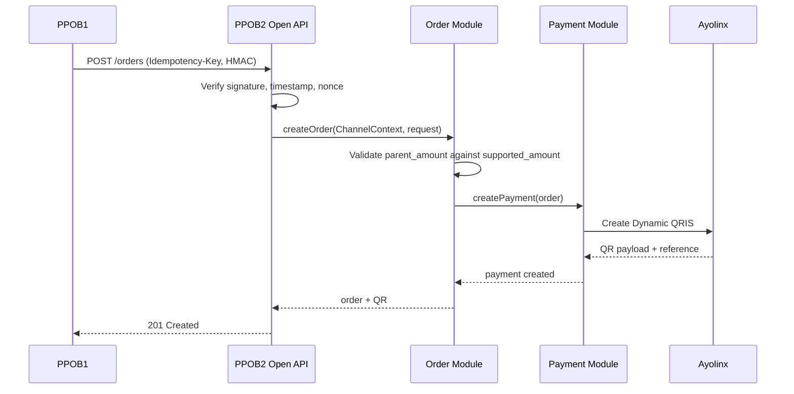

### 48.2 QRIS Payment Successful

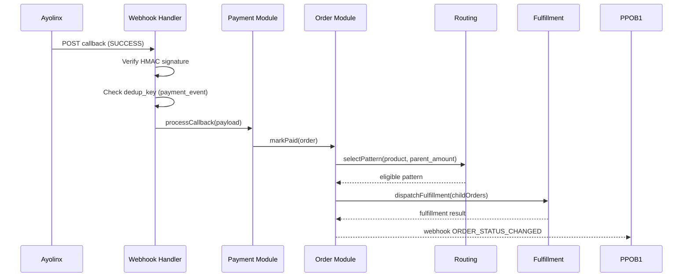

### 48.3 QR Expired

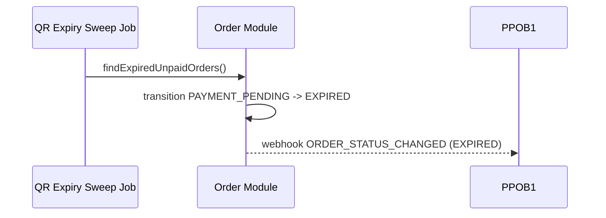

### 48.4 Duplicate Create Order

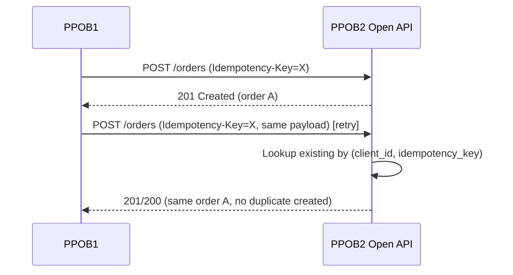

### 48.5 Duplicate PG Callback

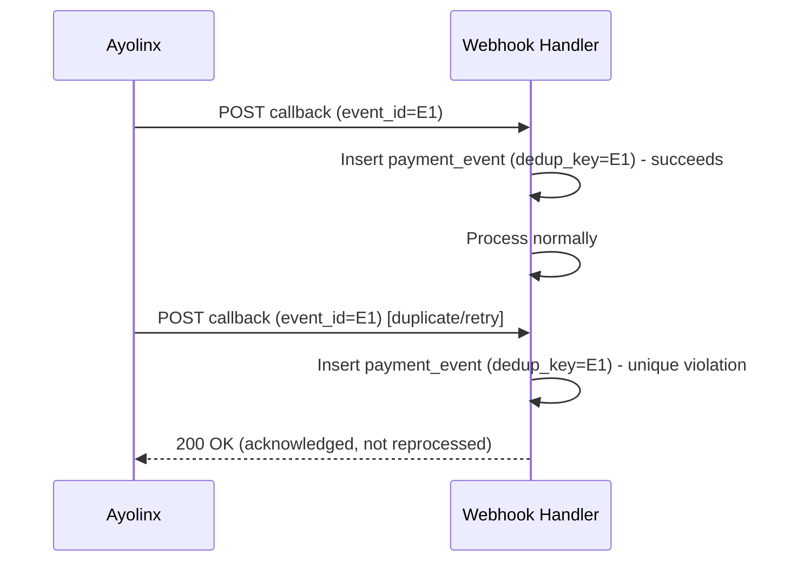

### 48.6 Successful Fulfillment

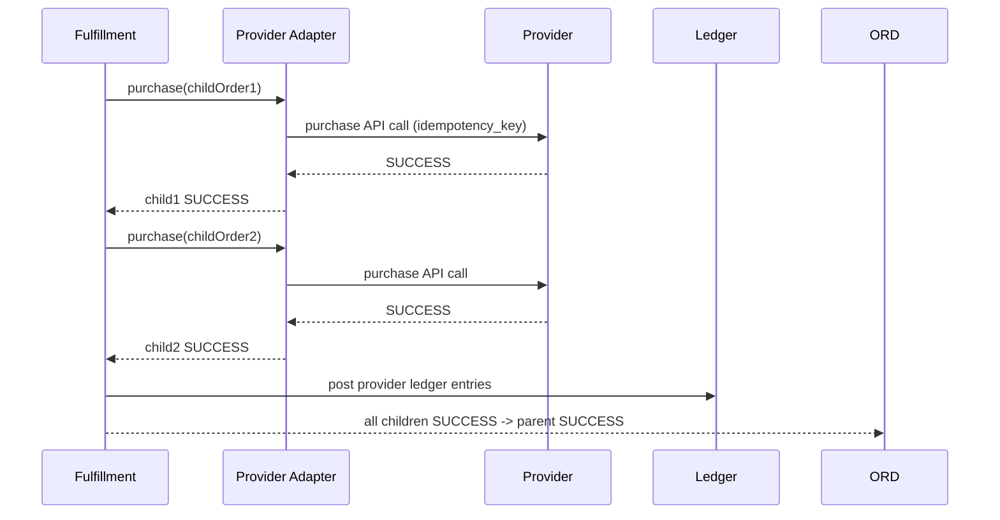

### 48.7 Partial Child Failure

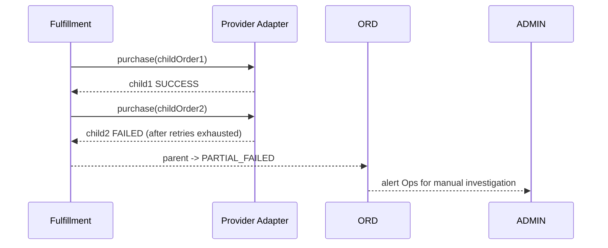

### 48.8 Provider Timeout

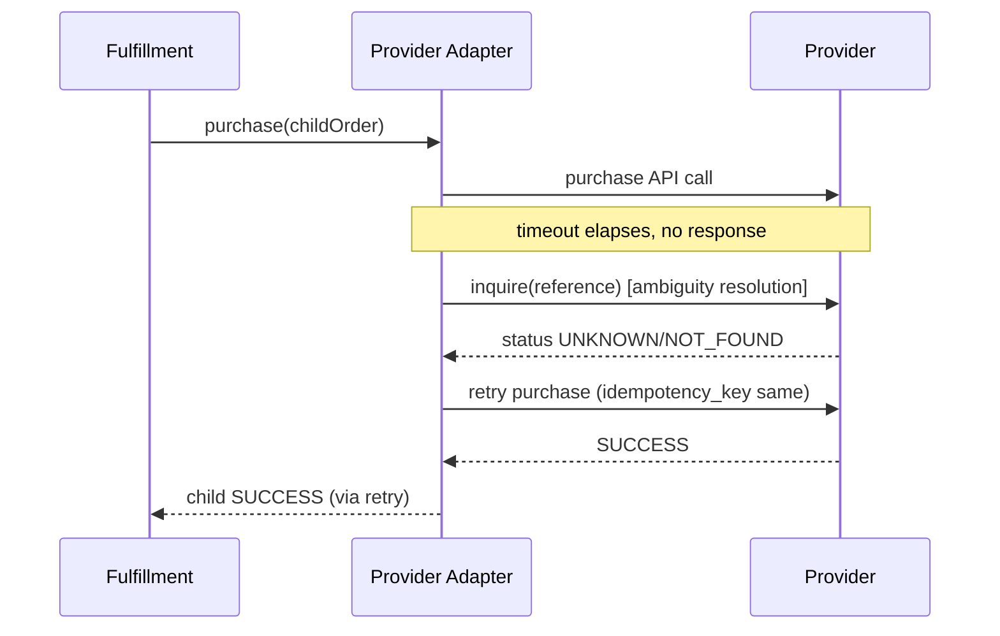

### 48.9 Price Refresh

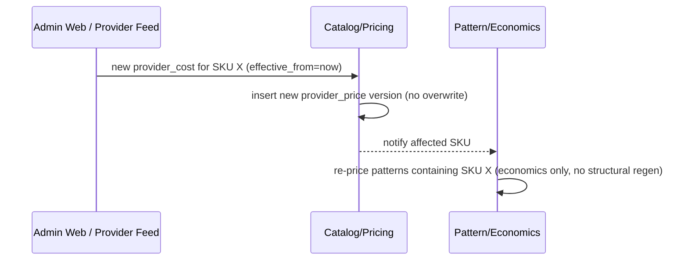

### 48.10 Daily Full Re-Score

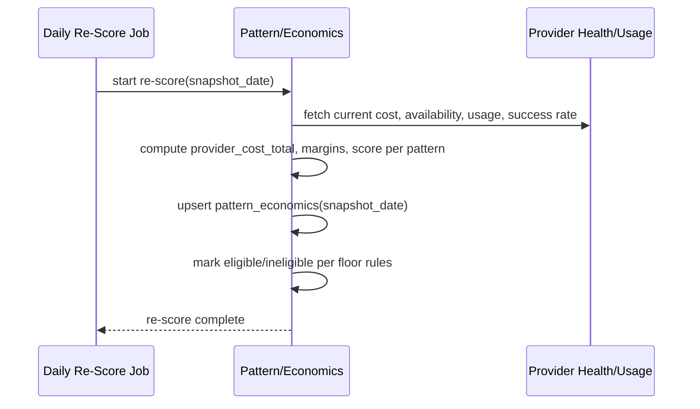

### 48.11 Structural Regeneration

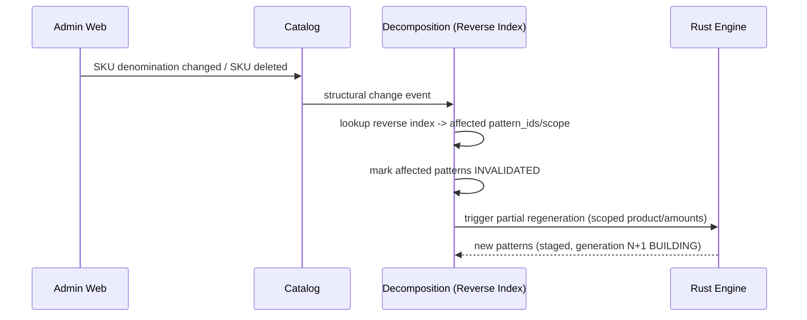

### 48.12 Pattern Activation

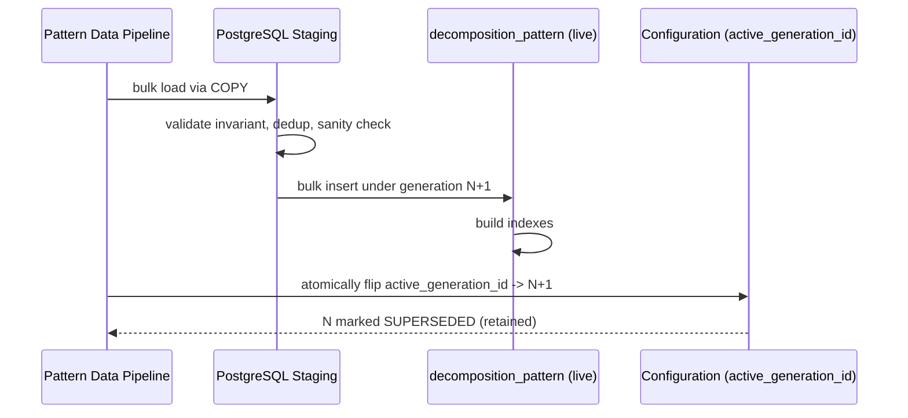

### 48.13 Settlement

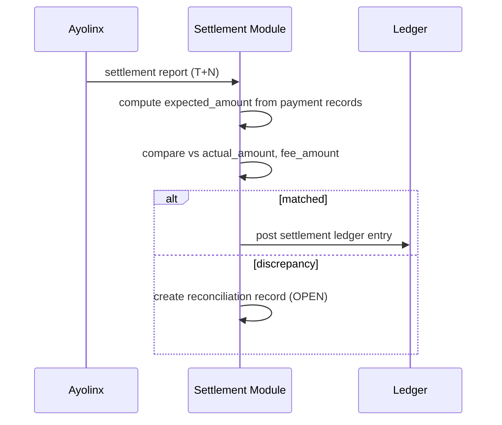

### 48.14 Reconciliation

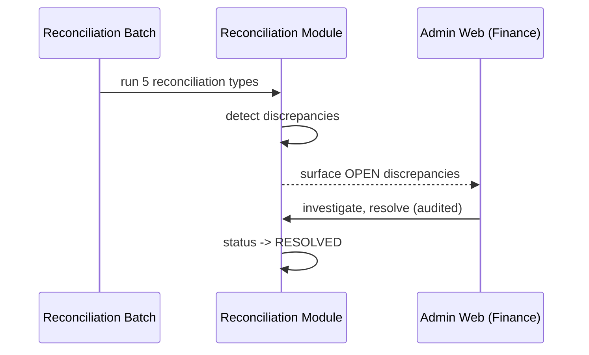

### 48.15 Admin Transaction Investigation

```mermaid
sequenceDiagram
    participant CS as Customer Service (Admin Web)
    participant ADM as Admin Backend
    participant ORD as Order Module
    CS->>ADM: search order by customer_reference
    ADM->>ORD: fetch parent order + child orders + timeline
    ORD-->>ADM: full trace (payment, pattern, provider txns)
    ADM-->>CS: parent-child trace view
    CS->>ADM: trigger authorized retry (if applicable)
    ADM->>ADM: audit_log entry recorded
```

### 48.16 Future PPOB2 Web Transaction

```mermaid
sequenceDiagram
    participant WEB as PPOB2 Web (Future)
    participant API as Customer API Adapter
    participant CORE as OrderApplicationService
    WEB->>API: POST /customer/orders (session/JWT)
    API->>API: resolve ChannelContext(userId, PPOB2_WEB)
    API->>CORE: createOrder(ChannelContext, request)
    Note over CORE: identical core logic to Partner API flow
    CORE-->>API: order + QR
    API-->>WEB: 201 Created
```

### 48.17 Future PPOB2 Mobile Transaction

```mermaid
sequenceDiagram
    participant APP as PPOB2 Android/iOS (Future)
    participant API as Customer API Adapter
    participant CORE as OrderApplicationService
    APP->>API: POST /customer/orders (device-bound token)
    API->>API: resolve ChannelContext(userId, deviceSessionId, PPOB2_ANDROID/IOS)
    API->>CORE: createOrder(ChannelContext, request)
    Note over CORE: identical core logic, no backend shortcut
    CORE-->>API: order + QR
    API-->>APP: 201 Created (push notification registered for async status)
```

---

## 49. Database ERD

```mermaid
erDiagram
    CHANNEL ||--o{ PARTNER : has
    PARTNER ||--o{ API_CLIENT : issues
    PARTNER ||--o{ PARENT_ORDER : places
    CHANNEL ||--o{ PARENT_ORDER : sources

    PRODUCT ||--o{ PROVIDER_SKU : offered_via
    PROVIDER ||--o{ PROVIDER_SKU : supplies
    PROVIDER_SKU ||--o{ PROVIDER_PRICE : priced_by

    PATTERN_GENERATION ||--o{ DECOMPOSITION_PATTERN : contains
    DECOMPOSITION_PATTERN ||--o{ DECOMPOSITION_COMPONENT : composed_of
    PROVIDER_SKU ||--o{ DECOMPOSITION_COMPONENT : referenced_by
    DECOMPOSITION_PATTERN ||--o{ PATTERN_ECONOMICS : scored_by
    DECOMPOSITION_PATTERN ||--o{ PATTERN_USAGE : tracked_by
    PROVIDER_SKU ||--o{ SKU_USAGE : tracked_by

    PARENT_ORDER ||--o{ CHILD_ORDER : decomposes_into
    PARENT_ORDER ||--|| PAYMENT : paid_via
    PARENT_ORDER }o--|| DECOMPOSITION_PATTERN : uses
    PAYMENT ||--o{ PAYMENT_EVENT : has
    CHILD_ORDER }o--|| PROVIDER_SKU : fulfills
    CHILD_ORDER ||--o| PROVIDER_TRANSACTION : executed_as
    PROVIDER ||--o{ PROVIDER_TRANSACTION : receives
    PROVIDER ||--o{ PROVIDER_BALANCE : tracked_by

    PARENT_ORDER ||--o{ LEDGER_ENTRY : generates
    PAYMENT ||--o{ LEDGER_ENTRY : generates
    PROVIDER_TRANSACTION ||--o{ LEDGER_ENTRY : generates
    SETTLEMENT ||--o{ LEDGER_ENTRY : generates
    SETTLEMENT ||--o{ RECONCILIATION : audited_by

    ADMIN_USER }o--o{ ROLE : assigned
    ROLE }o--o{ PERMISSION : grants
    ADMIN_USER ||--o{ AUDIT_LOG : performs
```

*(This ERD shows cardinality/relationship intent; exact FK column definitions are in Section 22.)*

---

## 50. API Examples

Consolidated request/response examples beyond Section 23 (Open API):

### 50.1 Error Envelope (Standard Shape)

```json
{
  "error_code": "VALIDATION_ERROR",
  "message": "Human-readable description",
  "details": [ { "field": "parent_amount", "issue": "must be one of the active supported amounts" } ],
  "correlation_id": "b3d1f9b0-...-e2",
  "timestamp": "2026-09-12T03:00:00Z"
}
```

### 50.2 Admin API: Trigger Authorized Retry (internal, session-authenticated)

`POST /admin/api/v1/orders/{order_id}/retry`
```json
{ "reason": "Provider timeout resolved upstream, retrying child order 2", "child_order_ids": [4582] }
```
Response:
```json
{ "order_id": "ORD-20260912-000123", "state": "FULFILLING", "audit_log_id": 99231 }
```

### 50.3 Admin API: Update Configuration

`PUT /admin/api/v1/config/routing-weights`
```json
{ "w_margin": 0.35, "w_provider": 0.2, "w_availability": 0.15, "w_capacity": 0.1, "w_loadbalance": 0.1, "w_childcount": 0.05, "w_failure": 0.05 }
```

---

## 51. Test Strategy

| Test Type | Scope | Tooling (indicative) |
|---|---|---|
| Unit Test | Domain logic, scoring formulas, state machine guards, money arithmetic | JUnit 5, Mockito |
| Integration Test | Module-to-module (order→payment→ledger), DB-backed | Spring Boot Test, Testcontainers (PostgreSQL, Redis) |
| API Test | Open API contract-level request/response, auth/signature | RestAssured / Spring MockMvc |
| Contract Test | PPOB1↔PPOB2 API contract stability | Pact or schema-based contract tests |
| DB Test | Schema migrations, constraints, invariants | Testcontainers + Flyway/Liquibase migration test suite |
| PG Sandbox Test | Ayolinx sandbox QRIS create/callback flows | Ayolinx sandbox environment (Phase 0 dependent) |
| Provider Sandbox Test | Provider adapter purchase/inquiry against sandbox | Provider sandbox environments (Phase 0 dependent) |
| End-to-End Test | Full order→payment→fulfillment→ledger flow | Automated E2E suite against SIT/UAT |
| Load Test | Sustained throughput at target TPS | k6 / Gatling / JMeter |
| Stress Test | Beyond-capacity behavior (graceful degradation vs collapse) | k6 / Gatling |
| Soak Test | Extended-duration stability (memory leak, connection exhaustion) | k6 / Gatling, extended run |
| Concurrency Test | Idempotency/race-condition correctness under parallel duplicate requests | Custom harness (parallel duplicate submission) |
| Security Test | AuthN/AuthZ, signature bypass attempts, injection | OWASP ZAP, manual/automated pen-test |
| Failure Injection | Simulated PG/provider/DB/Redis outages | Toxiproxy, chaos scripts |
| Recovery Test | Failover/DR execution validation | Manual/scripted DR drills |
| Batch Test | Rust engine correctness, throughput, determinism | Rust `cargo test`, property-based tests (`proptest`) |
| Reconciliation Test | All 5 reconciliation types against seeded discrepancy scenarios | Integration test suite with fixture data |
| Admin Web Test | UI functional coverage, RBAC enforcement | Playwright/Cypress |

---

## 52. Detailed Backend Test Cases

| ID | Test Case | Expected Result |
|---|---|---|
| TC-BE-001 | Create order with supported amount | 201 Created, `PAYMENT_PENDING` |
| TC-BE-002 | Create order with unsupported amount | 422 `UNSUPPORTED_AMOUNT` |
| TC-BE-003 | Create order with amount > QRIS limit | 422/400, order rejected |
| TC-BE-004 | Duplicate request (same Idempotency-Key, same body) | Same order returned, no duplicate created |
| TC-BE-005 | Idempotency conflict (same key, different body) | 409 `IDEMPOTENCY_KEY_CONFLICT` |
| TC-BE-006 | Payment created successfully | `payment` row created, QR returned, state `PAYMENT_PENDING` |
| TC-BE-007 | QR expiry sweep | Unpaid order past TTL → `EXPIRED` |
| TC-BE-008 | Payment success callback | Order → `PAID`, ledger entry posted |
| TC-BE-009 | Payment failed callback | Order remains/transitions appropriately, no fulfillment triggered |
| TC-BE-010 | Callback duplication (same dedup_key) | Second callback acknowledged, not reprocessed |
| TC-BE-011 | Callback replay (old timestamp/nonce reuse) | Rejected, signature_valid recorded appropriately |
| TC-BE-012 | Invalid signature on callback | 401, `payment_event.signature_valid=false`, no state change |
| TC-BE-013 | Provider timeout during fulfillment | Retry/inquiry path executes, eventual SUCCESS or FAILED after exhaustion |
| TC-BE-014 | Provider failure (explicit error response) | Child marked FAILED after retry exhaustion |
| TC-BE-015 | Duplicate fulfillment execution attempt (race) | Only one provider_transaction created (idempotency_key unique constraint holds) |
| TC-BE-016 | Partial fulfillment (1 of 2 children fail) | Parent → `PARTIAL_FAILED`, never silently `SUCCESS` |
| TC-BE-017 | All children succeed | Parent → `SUCCESS` |
| TC-BE-018 | No valid pattern exists for parent_amount | Order → `REFUND_PENDING`, alert fired |
| TC-BE-019 | Pattern quota exhausted | Pattern excluded from eligibility, alternate pattern selected |
| TC-BE-020 | SKU quota exhausted | SKU excluded, patterns containing it become ineligible |
| TC-BE-021 | Negative margin pattern | Flagged `eligible=false`, excluded from routing |
| TC-BE-022 | Provider price changed (no denomination change) | Re-price only, no structural regeneration triggered |
| TC-BE-023 | SKU disabled | Pattern invalidation triggered per Section 30.3 |
| TC-BE-024 | Generation validation failure | New generation stays `FAILED`, active generation unaffected |
| TC-BE-025 | Generation rollback | Active pointer reverts to previous generation, audited |
| TC-BE-026 | Redis down | Routing falls back to DB-backed lookup, correct pattern still selected (degraded latency) |
| TC-BE-027 | Database failure (simulated) | Requests fail fast with retryable error, no partial/corrupt writes |
| TC-BE-028 | Reconciliation discrepancy (seeded mismatch) | Discrepancy recorded with correct `discrepancy` value, status `OPEN` |
| TC-BE-029 | Cancel order in `CREATED` state | 200, state → `CANCELLED` |
| TC-BE-030 | Cancel order in `SUCCESS` state | 409 `ORDER_NOT_CANCELLABLE` |
| TC-BE-031 | Late callback after order EXPIRED | No auto-fulfillment; reconciliation record created for manual review |
| TC-BE-032 | Out-of-order terminal callbacks (FAILED after SUCCESS) | SUCCESS not overwritten; anomaly logged for review |

---

## 53. Decomposition Property Tests

**Mandatory property** (validated via property-based/randomized testing, e.g., Rust `proptest` for the engine and a QuickCheck-style Java property test for any application-side re-validation):

> For every valid, `ACTIVE`-generation pattern: `SUM(component.face_value × component.quantity) == parent_amount`.

| ID | Property Test | Method |
|---|---|---|
| TC-PROP-001 | Invariant holds across randomly sampled parent_amounts within supported range | Generate N random amounts within [10,000, 10,000,000], assert invariant on all produced patterns |
| TC-PROP-002 | Invariant holds across randomly generated SKU denomination sets | Randomize provider_sku face_values (bounded, realistic ranges), assert generator either produces invariant-satisfying patterns or correctly reports zero feasible patterns |
| TC-PROP-003 | No pattern exceeds configured max component count under default pruning config | Assert `component_count <= configured_max` for all generated patterns |
| TC-PROP-004 | Determinism: same input configuration + seed produces identical pattern set | Run generation twice with identical inputs/seed, assert byte-identical or hash-identical output |
| TC-PROP-005 | De-duplication: no two patterns in the same generation share an identical `pattern_hash` | Assert uniqueness constraint holds post-generation |

---

## 54. Admin Web Test Cases

| ID | Test Case | Expected Result |
|---|---|---|
| TC-ADM-001 | Login with valid credentials (+MFA where required) | Successful session established |
| TC-ADM-002 | Login with invalid credentials | Rejected, failure audit-logged |
| TC-ADM-003 | RBAC: VIEWER attempts a mutating action | 403 Forbidden, action blocked |
| TC-ADM-004 | RBAC: FINANCE accesses reconciliation module | Access granted per permission matrix |
| TC-ADM-005 | Permission: user without `retry:execute` attempts retry | Blocked, audit-logged as denied attempt |
| TC-ADM-006 | Transaction search by customer_reference | Correct parent order(s) returned |
| TC-ADM-007 | Parent-child drilldown | Full trace shown: payment, pattern, child orders, provider transactions |
| TC-ADM-008 | Pricing update (new provider_cost) | New `provider_price` version created, old version's `effective_until` set, no overwrite |
| TC-ADM-009 | Configuration update (supported amount) | New config takes effect for subsequent order validation, audit-logged with before/after |
| TC-ADM-010 | Pattern viewing (by pattern_id) | Components and economics displayed correctly |
| TC-ADM-011 | Generation activation | Atomic flip verified; previous generation marked SUPERSEDED, not deleted |
| TC-ADM-012 | Retry authorization workflow | Retry requires permission + reason text; recorded in audit_log |
| TC-ADM-013 | Audit log completeness | Every mutating admin action produces exactly one corresponding audit_log entry |
| TC-ADM-014 | Settlement display | Expected vs actual vs fee shown accurately for a given settlement_date |
| TC-ADM-015 | Reconciliation handling | Discrepancy can be moved OPEN → INVESTIGATING → RESOLVED with resolver recorded |

---

## 55. Performance Testing

### 55.1 Load Profiles

| Profile | Description |
|---|---|
| Normal | ~4,000 tx/day sustained pattern (accounting for realistic diurnal peak, not flat distribution) |
| 5x Peak | 5× the observed peak-hour rate |
| 10x Peak | 10× the observed peak-hour rate (stress boundary) |
| Burst | Short-duration spike (e.g., promo event) far exceeding 10x for a brief window, testing queuing/backpressure behavior |

### 55.2 Metrics Captured

p50/p95/p99 latency · error rate · CPU · RAM · GC pause/frequency (JVM) · DB connection pool utilization · thread pool utilization/queue depth · Redis latency · provider adapter latency (per provider, sandbox-simulated).

### 55.3 Batch Performance Metrics

Patterns generated per second (Rust engine) · full generation duration (per product/amount grid) · daily re-score duration · bulk load duration (COPY throughput) · activation duration (atomic flip latency).

### 55.4 Acceptance Thresholds

Tied to the NFR targets in Section 16; any load test result breaching those targets is a release blocker pending optimization or target renegotiation with stakeholders — not silently accepted.

---

## 56. Security Testing

- **Static Analysis (SAST)**: integrated into CI (Section 57) for both Java and Rust codebases.
- **Dependency Scanning**: SCA tooling (e.g., OWASP Dependency-Check / Snyk) on every build.
- **Dynamic Testing (DAST)**: OWASP ZAP baseline scan against SIT/UAT environments.
- **Signature/Replay Bypass Attempts**: dedicated test suite attempting expired timestamps, reused nonces, tampered signatures, and confirming rejection.
- **RBAC Boundary Testing**: automated matrix test asserting every permission-role combination behaves per Section 42.2.
- **Injection Testing**: parameterized-query enforcement verified; attempted SQLi payloads against all input fields confirmed harmless.
- **Secrets Exposure Testing**: log output and error responses audited for accidental secret/PII leakage.
- **Penetration Testing**: full external pentest prior to production go-live (Production Readiness gate, Section 58) — **must be scheduled and scoped with a qualified third party**.

---

## 57. Deployment Architecture

```mermaid
flowchart TB
    subgraph Edge
        LB[Load Balancer / Reverse Proxy\nTLS termination]
    end
    subgraph AppTier
        API1[PPOB2 Backend Instance 1]
        API2[PPOB2 Backend Instance 2]
        ADM1[Admin Web/Backend Instance]
    end
    subgraph DataTier
        PGP[(PostgreSQL Primary)]
        PGR[(PostgreSQL Replica)]
        RD[(Redis)]
    end
    subgraph OfflineTier
        RUSTJ[Rust Engine\n(scheduled/batch host)]
    end
    LB --> API1
    LB --> API2
    LB --> ADM1
    API1 --> PGP
    API2 --> PGP
    API1 --> RD
    API2 --> RD
    PGP --> PGR
    RUSTJ --> PGP
```

Each component runs in Docker containers. For MVP scale (4,000 tx/day baseline), a simple multi-instance deployment behind a load balancer/reverse proxy (e.g., Nginx or a managed cloud LB) is sufficient — full Kubernetes orchestration is evaluated but **not mandated** unless operational scale or team practice already favors it; introducing K8s purely for perceived enterprise-readiness is explicitly discouraged (mirrors the Kafka/RabbitMQ caution in Section 19.1).

### 57.1 Environments

| Environment | Purpose | Data |
|---|---|---|
| LOCAL | Developer machine | Synthetic/local seed data |
| DEV | Shared integration point for in-progress features | Synthetic data, resettable |
| SIT | System Integration Testing (incl. PG/provider sandboxes) | Synthetic + sandbox test data |
| UAT | User Acceptance Testing / stakeholder sign-off | Anonymized/synthetic production-like data |
| STAGING (optional) | Final pre-production rehearsal, production-parity config | Anonymized production-like data |
| PRODUCTION | Live traffic | Real data, strictest access control |

Data/environment separation: no real customer or financial data flows into LOCAL/DEV/SIT/UAT; production credentials and secrets are scoped exclusively to PRODUCTION (and STAGING only if it mirrors production connectivity); each environment has isolated PostgreSQL/Redis instances — no shared infrastructure between non-production and production.

---

## 58. CI/CD

### 58.1 Pipeline Stages

1. **Source Control**: Git, trunk-based or short-lived feature branches merged via PR with mandatory review.
2. **Branch Strategy**: `main` (always deployable), feature branches, release tags for production deployments.
3. **Build**: Maven/Gradle build for Java modules; `cargo build --release` for the Rust engine.
4. **Test**: unit + integration test suites (Section 51) run on every PR; full suite (including Testcontainers-based integration tests) gates merge to `main`.
5. **Security Scan**: SAST + SCA (Section 56) gates merge; DAST runs against deployed SIT/UAT on a schedule.
6. **Docker Build**: multi-stage Dockerfiles producing minimal runtime images; images scanned for vulnerabilities before push.
7. **Artifact Versioning**: semantic versioning + Git SHA tagging for every built image/artifact.
8. **Deployment**: automated deployment to DEV/SIT on merge to `main`; manual promotion gate to UAT/PRODUCTION.
9. **DB Migration**: versioned migrations (Flyway/Liquibase) applied as a distinct, reviewed pipeline step — never ad-hoc schema changes.
10. **Rollback**: prior artifact version + prior DB migration's down-script (where safe/reversible) retained and documented per release; database migrations favor additive/backward-compatible changes to keep rollback low-risk.

---

## 59. Disaster Recovery

### 59.1 RPO/RTO Targets

Per Section 16 NFR: RPO ≤ 5 minutes (transactional DB), RTO ≤ 30 minutes (primary service restoration), ≤ 4 hours (full DR to a secondary region/environment, if provisioned).

### 59.2 DR Mechanisms

- PostgreSQL: continuous WAL archiving + point-in-time recovery; a warm standby replica promotable on primary failure.
- Redis: treated as a rebuildable cache (Section 47, "Redis down" handling) — not a system of record, so DR for Redis is simply "redeploy and let cache-aside repopulate," not backup/restore.
- Application tier: stateless, horizontally redeployable from container images; no DR complexity beyond infra provisioning.
- Rust batch artifacts: staged outputs retained (Section 40.1) so a failed activation can be retried without re-running the full generation.
- Backup verification: scheduled restore-drill (e.g., quarterly) to confirm backups are actually restorable, not merely "backups exist."

---

## 60. Operational Runbook

### 60.1 Runbook Topics (to be authored in detail during Phase 9/10, indexed here)

- **Incident Response**: on-call escalation path, severity classification (Sev1: payment/fulfillment down; Sev2: degraded provider; Sev3: cosmetic/admin-only issue).
- **SOP — Reconciliation Discrepancy**: triage steps, escalation to Finance, resolution documentation requirements (Section 38.2).
- **SOP — Refund**: authorization chain, PaymentGateway refund execution steps, ledger reversal verification (Section 25.2, 43).
- **SOP — Provider Failure**: how to temporarily disable a provider/SKU (Section 32.2), how to verify recovery before re-enabling.
- **SOP — Provider Deposit Top-up**: manual/automated top-up trigger and balance verification (Section 39).
- **SOP — Pattern Generation Failure**: diagnosis steps, safe retry, confirming the active generation remains unaffected (Section 40.2).
- **SOP — Manual Retry Authorization**: who may approve, required justification, audit verification (Section 43).

---

## 61. Production Readiness Checklist

| Item | Status Gate |
|---|---|
| Ayolinx PG contract finalized & sandbox validated | **Must be verified** |
| Provider contracts finalized (cost, SLA, quota) for launch product set | **Must be verified** |
| All production credentials provisioned via secret management (no manual handling) | Required |
| Security review completed (SAST/SCA/DAST clean, no critical findings open) | Required |
| Penetration test completed and critical/high findings remediated | Required |
| Database backup + PITR verified via restore drill | Required |
| DR plan documented and at least tabletop-tested | Required |
| Monitoring dashboards live (Section 46) | Required |
| Alerting configured and tested (simulated trigger confirms delivery) | Required |
| Operational runbook authored and reviewed by Ops/Finance/Security (Section 60) | Required |
| Reconciliation SOP signed off by Finance | Required |
| Refund SOP signed off by Finance/Compliance | Required |
| Provider failure SOP signed off by Operations | Required |
| Admin Web RBAC reviewed and least-privilege confirmed | Required |
| Load test passed at target NFR thresholds (Section 55.4) | Required |
| Rollback procedure tested end-to-end (app + DB migration) | Required |
| Supported-amount and pattern-coverage validated (≥95% amounts have eligible patterns) | Required |

---

## 62. Future PPOB2 Web Architecture

### 62.1 Technology Evaluation

| Option | Pros | Cons |
|---|---|---|
| React (SPA) | Large ecosystem, flexible | Requires separate SEO/SSR strategy if needed |
| **Next.js (React-based, SSR/SSG capable)** | SEO-friendly for a public storefront, good DX, incremental adoption path | Slightly more opinionated/framework lock-in |
| Vue/Nuxt | Comparable capability to Next.js | Smaller hiring pool in some markets than React ecosystem |

**Leaning recommendation**: Next.js (or equivalent React-based SSR framework) for the future customer web app, given a public-facing storefront benefits from SEO and fast first-paint — but this is explicitly a **future decision**, not committed in this MVP PRD, and must be revisited with actual team/skill constraints at Phase 11 kickoff.

### 62.2 Functional Requirements (Documented for Future Build, Not Implemented in MVP)

Browse product catalog · Login/guest checkout · Game account input (customer_reference equivalent) · Checkout flow · QRIS payment display · Payment status polling/webhook-driven update · Transaction history · Transaction detail · Notification (email/push/in-app) · Customer support entry point.

### 62.3 Backend Dependency

The future Web app calls the **same PPOB2 Core API** (Section 24, Future Customer API) via a thin customer-facing channel adapter — it does not introduce new backend business logic, only a new `ChannelType = PPOB2_WEB` context and a customer-identity-aware authentication layer (Section 24.1).

---

## 63. Future PPOB2 Mobile Architecture

### 63.1 Technology Evaluation

| Option | Pros | Cons |
|---|---|---|
| Flutter | Single codebase for Android+iOS, good performance, growing ecosystem | Dart is a smaller talent pool; native module gaps occasionally |
| React Native | Single codebase, large ecosystem, JS/TS skill reuse from web team | Bridge-related performance considerations for very demanding UI |
| Native Android (Kotlin) + Native iOS (Swift) | Best platform-specific performance/UX fidelity | Two codebases, higher cost/time-to-market |

**No framework is decided here** — this is explicitly a future trade-off decision (per Section 27 of the master prompt) to be made at Phase 12 kickoff based on team composition, required native feature depth (e.g., biometric, deep push integration), and time-to-market pressure.

### 63.2 Functional Requirements (Documented for Future Build, Not Implemented in MVP)

Android/iOS native or cross-platform app · authentication (with device binding considerations for fraud/abuse mitigation) · push notification (order/payment status) · order creation/history · QRIS payment display (QR render + possibly deep-link to banking apps) · transaction history/detail · customer support · biometric authentication (optional enhancement).

### 63.3 Backend Dependency & Anti-Pattern Warning

Mobile apps **must not** get a direct database or backend shortcut (e.g., a mobile-only internal API bypassing `OrderApplicationService`, or direct DB read replicas exposed to the app). All mobile traffic flows through the same Customer API / core service path as Web (Section 24, 62.3), differing only in the channel context and authentication mechanism (e.g., device-bound token, Section 18.1 `deviceSessionId`).

---

## 64. Requirement Traceability Matrix (RTM)

The RTM links Business Requirement → Functional Requirement → Module → API → Database → Test. A representative sample is shown; the complete matrix (covering all FR/BR IDs from Sections 14–17) should be maintained as a living spreadsheet/tool artifact (e.g., Jira/Confluence linked fields) alongside this PRD, since full enumeration of every ID's linkage is impractical to keep current in static prose.

| Business Req | Functional Req | Module | API | Database | Test Case |
|---|---|---|---|---|---|
| BR-BUS-002 | FR-PAY-001..007 | `payment` | `POST /orders`, webhook `/internal/webhooks/ayolinx` | `payment`, `payment_event` | TC-BE-006..012, TC-BE-031..032 |
| BR-BUS-003 | FR-DEC-001..005 | `decomposition` | (internal, consumed by `routing`) | `decomposition_pattern`, `decomposition_component`, `pattern_generation` | TC-PROP-001..005, TC-BE-018..019 |
| BR-BUS-004 | FR-RTE-001..003 | `routing` | (internal) | `pattern_economics`, `pattern_usage` | TC-BE-021 |
| BR-BUS-005 | FR-ADM-001..003 | `admin` | `/admin/api/v1/*` | `admin_user`, `role`, `permission`, `audit_log` | TC-ADM-001..015 |
| BR-BUS-006 | FR-REC-001..003 | `ledger`, `reconciliation` | Admin Web reconciliation views | `ledger_entry`, `reconciliation`, `settlement` | TC-BE-028 |
| BR-REC-002 | FR-REC-004 | `settlement` | Admin Web settlement view (Section 41.8 partner breakdown) | `settlement_partner_allocation` | TC-BE-033..034 (exact-attribution join; pro-rata largest-remainder invariant) |
| BR-BUS-007 | (architectural, Section 18/24/28) | `order`, `channel` | `/api/v1/orders` (Partner), future `/api/v1/customer/orders` | `channel`, `parent_order.channel_id/order_source` | (architecture review, no single TC — validated via ArchUnit dependency tests) |
| BR-BUS-009 | FR-CAT-004 | `configuration`, `pricing` | `GET /api/v1/config/supported-amounts` | `supported_amount` | TC-BE-002 |

---

## 65. Risk Register

| Risk | Probability | Impact | Mitigation | Owner | Indicator |
|---|---|---|---|---|---|
| Provider price volatility | High | Medium | Daily re-scoring, versioned pricing, negative-margin alerting | Finance/Product | Frequency of `provider_price` version changes; margin trend |
| Provider downtime | Medium | High | Circuit breaker, multi-provider routing diversity, health checks | Engineering/Ops | Provider error rate, circuit breaker open events |
| Payment downtime (Ayolinx) | Low-Medium | High | Circuit breaker, clear customer-facing error, alerting | Engineering/Ops | PG error rate, `PG_UNAVAILABLE` frequency |
| Duplicate callbacks | Medium | Low (if handled) / High (if not) | Idempotency via `dedup_key`, thoroughly tested (TC-BE-010) | Engineering | Duplicate-callback rejection count (should be non-zero and handled, not absent) |
| Duplicate fulfillment | Low (if idempotency holds) | High | Idempotency key + distributed lock (Section 34.1) | Engineering | `provider_transaction` idempotency constraint violations (should trend to zero exceptions, all caught) |
| Partial failure (parent stuck) | Medium | Medium | Explicit `PARTIAL_FAILED` state, Ops runbook, alerting | Engineering/Ops | Count of orders in `PARTIAL_FAILED` beyond SLA |
| Reconciliation mismatch | Medium | Medium-High | Daily reconciliation batch, discrepancy workflow | Finance/Reconciliation | Open discrepancy count/age |
| Provider deposit shortage | Medium | High (blocks fulfillment) | Balance threshold alerting (Section 39.2) | Finance/Ops | Days-of-runway metric per provider |
| Settlement delay | Low-Medium | Medium | Settlement reconciliation, escalation SOP | Finance | Settlement `DISCREPANCY` status frequency/age |
| Partner allocation dispute / unverifiable split | Medium | Medium-High (multiplies with partner count; higher when a partner is an externally-owned business, not an internal sub-account) | `EXACT` attribution preferred over `PRO_RATA` wherever the Ayolinx report supports it (Section 37.3); largest-remainder rounding invariant enforced at write time; allocation method and reconciling total always visible in Admin Web (Section 41.8), never computed ad hoc outside the system | Finance/Product | `PRO_RATA` allocation frequency (should trend toward `EXACT` as report fidelity improves); count of allocations failing the sum-invariant (should be zero, all rejected before persist) |
| Negative margin | Medium | Medium-High | Real-time/daily eligibility exclusion, alerting | Product/Finance | Count of negative-margin patterns/orders |
| Stale pricing | Medium | Medium | Versioned pricing with mandatory `effective_from`, alert on stale (no update > N days) | Product/Finance | Days since last `provider_price` update per SKU |
| Pattern failure (no eligible pattern) | Medium | High (blocks transaction) | Generation coverage target (Section 29.3), alerting, fallback amount suggestions | Product/Engineering | Count of `REFUND_PENDING` due to no-pattern |
| DB growth (pattern tables at ~1.18M+ rows) | Medium | Medium | Partitioning strategy evaluation, archival of `SUPERSEDED` generations, index tuning | DBA | Table size growth rate |
| Redis outage | Low-Medium | Medium (degrades, doesn't fail hard) | DB fallback path (Section 47), cache-aside repopulation | Engineering/SRE | Redis availability metric |
| Security breach | Low | Critical | Full Section 44/56 controls, pentest | Security | Anomalous access patterns, failed-auth spikes |
| Credential leak | Low | Critical | Secret management, rotation policy | Security | Secret-scanning alerts |
| Admin misuse | Low | High | RBAC least-privilege, dual-authorization for critical actions, full audit trail | Security/Ops | Audit log anomaly review |
| Regulatory/payment contract change | Medium | Medium-High | Explicit "must be verified" flags throughout PRD, config-driven commercial rules (never hard-coded) | Product/Compliance | Contract renewal/regulatory review calendar |

---

## 66. Financial Model

### 66.1 Definitions (Reiterated with Formulas)

- **GMV** = Σ `parent_amount` across all `SUCCESS` orders in period.
- **Provider Cost** = Σ `provider_cost_total` (from `pattern_economics`, actualized post-fact per order) across `SUCCESS` orders.
- **Gross Product Profit** = GMV − Provider Cost.
- **Gross Margin** = Gross Product Profit / GMV.
- **Payment Cost** = Σ actual PG fee (MDR, **must be verified against contract**) across period.
- **Net Contribution** = Gross Product Profit − Payment Cost − directly attributable transaction cost (e.g., provider-side transaction fees if separately billed).
- **Refund Loss** = Σ refunded amounts not recovered from provider/PG.
- **OPEX** = Payroll, infrastructure, tooling, and other operating expenses (outside this PRD's system scope — sourced from Finance's own accounting system).
- **Accounting Net Profit** = Net Contribution − OPEX − Payroll − Infrastructure − Tax − Fraud Loss − Refund Loss − other operational expense. **This PRD's `net_contribution` metric is explicitly NOT this figure** (Section 22 terminology note) — it is an operational/transactional profitability signal for routing and margin monitoring, not a statutory accounting result.

### 66.2 Margin Is Not Flat Across Products (Explicit Caution)

Margin must be computed **per product/provider/pattern** using actual provider pricing where available. Any illustrative numbers used in early design discussions (e.g., a flat "10% margin" assumption) are **dummy simulation assumptions only**, must be explicitly labeled as such wherever they appear, and must never be treated as a real target until actual provider contracts are in hand (**must be verified**).

### 66.3 Illustrative Simulation (Explicitly Marked as Assumption)

| Metric | Illustrative Value (ASSUMPTION — not real data) |
|---|---|
| Avg transactions/day | 4,000 |
| Avg parent_amount | Rp75,000 (illustrative) |
| Illustrative daily GMV | Rp300,000,000 |
| Illustrative avg gross margin | 8% (placeholder — **must be verified against real provider cost**) |
| Illustrative daily gross profit | Rp24,000,000 |

This table exists purely to demonstrate the *shape* of the financial model calculation and MUST be replaced with real figures once Phase 0 contract data is available.

---

## 67. Development Roadmap

| Phase | Name | Key Deliverables |
|---|---|---|
| Phase 0 | Discovery & Contract Validation | Ayolinx contract review, provider contract review, regulatory check, finalize all "must be verified" items where possible |
| Phase 1 | Platform Foundation | Modular monolith skeleton, CI/CD pipeline, environments (Section 57.1), base observability |
| Phase 2 | Catalog & Provider Foundation | `catalog`, `provider` modules, `GameProvider` abstraction, first adapter(s) against sandbox |
| Phase 3 | Open API PPOB1 | `channel`, `partner`, `api_client`, Order creation/read/cancel endpoints, HMAC auth |
| Phase 4 | Payment / QRIS | `PaymentGateway` abstraction, `AyolinxPaymentGateway`, webhook handling, QR lifecycle |
| Phase 5 | Decomposition Engine | Rust engine MVP (DP + K-Best + B&B), pattern data pipeline, generation versioning |
| Phase 6 | Pricing / Margin / Routing | `pricing`, daily economics/re-score job, `routing` scoring engine |
| Phase 7 | Fulfillment | `fulfillment` orchestration, concurrency control, compensation handling |
| Phase 8 | Ledger / Settlement / Reconciliation | `ledger`, `settlement`, `reconciliation` modules, all 5 reconciliation types |
| Phase 9 | Admin / Backoffice | Full Admin Web (Section 41), RBAC (Section 42) |
| Phase 10 | Security / Performance / Production Readiness | Full Section 44/56 security hardening, load testing (Section 55), Section 61 checklist closure |
| Future Phase 11 | PPOB2 Customer Web | Per Section 62 |
| Future Phase 12 | PPOB2 Android/iOS | Per Section 63 |

---

## 68. Development Backlog

Backlog uses EPIC → Feature → User Story → Technical Task, classified MVP Mandatory / Production Mandatory / Future Enhancement. A representative slice is provided below; the full backlog (hundreds of stories) should be maintained in a tracking tool (Jira/Linear) seeded from this structure.

### EPIC-01: Order Management [MVP Mandatory]

- **Feature 01.1**: Order creation via Partner API
  - **Story 01.1.1**: As PPOB1, I can create an order for a supported amount so that a customer can pay for a top-up. *(Priority: P0, Complexity: M, Dependency: Catalog+Config, AC: TC-BE-001/002/003)*
    - Task: Implement `OrderApplicationService.createOrder()`
    - Task: Implement idempotency-key handling (unique constraint + lookup)
    - Task: Implement supported-amount validation against `supported_amount`
  - **Story 01.1.2**: As PPOB1, retrying a create-order request with the same Idempotency-Key never creates a duplicate order. *(P0, S, Dep: 01.1.1, AC: TC-BE-004/005)*
- **Feature 01.2**: Order status & cancellation
  - **Story 01.2.1**: As PPOB1, I can query order status. *(P0, S, AC: TC-BE section)*
  - **Story 01.2.2**: As PPOB1, I can cancel an order before payment. *(P1, S, AC: TC-BE-029/030)*

### EPIC-02: Payment Integration [MVP Mandatory]

- **Feature 02.1**: Dynamic QRIS via Ayolinx — Story: create payment, handle callback, handle expiry, handle duplicate/replay (P0, L, AC: TC-BE-006..012)
- **Feature 02.2**: Refund/Reversal — Story: authorized refund initiation from Admin Web (P1, M, Dep: Admin RBAC, AC: TC-ADM refund flow)

### EPIC-03: Decomposition Engine [MVP Mandatory]

- **Feature 03.1**: Rust offline generator — Story: DP+K-Best+B&B pattern generation per (product, amount) (P0, XL, AC: TC-PROP-001..005)
- **Feature 03.2**: Pattern data pipeline — Story: COPY-based bulk load, staging validation, atomic activation (P0, L, Dep: 03.1)
- **Feature 03.3**: Structural invalidation — Story: reverse-index-driven partial regeneration on SKU change (P0, M, Dep: 03.2)

### EPIC-04: Pricing, Margin & Routing [MVP Mandatory]

- **Feature 04.1**: Daily re-score job (P0, M, Dep: 03.2)
- **Feature 04.2**: Configurable routing/scoring weights (P0, M, Dep: 04.1)
- **Feature 04.3**: Negative-margin alerting (P1, S, Dep: 04.1)

### EPIC-05: Provider Integration & Fulfillment [MVP Mandatory]

- **Feature 05.1**: `GameProvider` abstraction + first adapter (P0, L)
- **Feature 05.2**: Fulfillment orchestration with concurrency control (P0, L, Dep: 05.1)
- **Feature 05.3**: Circuit breaker / health check per provider (P0, M, Dep: 05.1)
- **Feature 05.4**: Provider deposit balance tracking + threshold alert (P1, M)

### EPIC-06: Ledger, Settlement, Reconciliation [Production Mandatory]

- **Feature 06.1**: Four-ledger append-only posting (P0, M)
- **Feature 06.2**: Settlement ingestion + matching (P0, M, Dep: Ayolinx settlement report format — Phase 0)
- **Feature 06.3**: Five reconciliation types + discrepancy workflow (P0, L)
- **Feature 06.4**: Per-partner settlement allocation — `EXACT`/`PRO_RATA` attribution, largest-remainder rounding, Admin Web breakdown view (P1, M, Dep: confirming whether the Ayolinx settlement report carries per-transaction lines, same open dependency as Feature 06.2 — Section 37.3)

### EPIC-07: Admin / Backoffice [MVP Mandatory]

- **Feature 07.1**: Auth + RBAC + MFA (P0, L)
- **Feature 07.2**: Dashboard, Transactions, Catalog, Decomposition, Margin, Quota, Payment, Settlement, Reconciliation, Operations, Configuration, Audit menus (P0, XL — one story per menu, see Section 41)

### EPIC-08: Security & Observability [Production Mandatory]

- **Feature 08.1**: HMAC/signature framework for Open API (P0, M)
- **Feature 08.2**: Structured logging, metrics, tracing, dashboards, alerts (P0, L)
- **Feature 08.3**: Pentest remediation (P0, varies, Dep: Phase 10)

### EPIC-09: Future Customer Channels [Future Enhancement]

- **Feature 09.1**: Future Customer API (auth, thin adapter) — Future
- **Feature 09.2**: PPOB2 Web App — Future
- **Feature 09.3**: PPOB2 Android/iOS App — Future

---

## 69. Acceptance Criteria (Cross-Cutting)

Every EPIC/Feature above inherits these cross-cutting acceptance criteria unless explicitly scoped out:

1. No monetary field uses floating point anywhere in the code path (Section 21.1).
2. Every mutating admin action produces an audit log entry (Section 43).
3. Every external-facing mutating endpoint enforces idempotency (Section 23, 25, 27).
4. Every decomposition pattern satisfies the value invariant (Section 28.2) — verified by property tests (Section 53) in CI, not just at generation time.
5. No channel-specific business logic exists inside `OrderApplicationService` or below (Section 18.1) — verified by architecture tests (e.g., ArchUnit rules forbidding channel-type branching in domain services).
6. All commercial/regulatory constants are configuration-driven, never hard-coded (Section 10, AS-11).
7. Load test targets (Section 16/55) pass before any Production Readiness sign-off.

---

## 70. Design Challenges / Recommendations

### DC-01: Synchronous PG Call During Order Creation

- **Problem**: `POST /orders` currently calls `PaymentGateway.createDynamicQris()` synchronously, coupling the customer-facing request's latency directly to Ayolinx's response time.
- **Risk**: If Ayolinx experiences elevated latency (not full outage), PPOB2's own p95/p99 API latency degrades proportionally, and a naive retry-on-timeout could double-create QR requests at the PG.
- **Recommended Approach**: Keep QR creation synchronous for MVP (simplicity, and channels expect a QR in the response) but enforce a strict timeout with a single internal retry budget, and treat a timeout as `503 PG_UNAVAILABLE` rather than hanging — never silently retry indefinitely. Revisit an async "create order → poll/webhook for QR readiness" pattern only if real latency data from Phase 0/sandbox testing shows this is a recurring problem.
- **Trade-off**: Sync is simpler and matches PPOB1's likely expectation of an immediate QR; async adds complexity (a new "QR_PENDING" sub-state and a client-facing polling/webhook contract) that isn't justified without evidence of a real latency problem.

### DC-02: One Payment Per Parent Order (MVP Assumption)

- **Problem**: Section 22.17 models `payment` as 1:1 with `parent_order`. Real-world edge cases (customer under-pays via a manual QR mismatch, or a payment needs re-issuance) could require multiple payment attempts per order.
- **Risk**: A rigid 1:1 model may force awkward workarounds (e.g., cancel-and-recreate) if multi-attempt payment becomes a real requirement.
- **Recommended Approach**: Keep 1:1 for MVP (QRIS Dynamic with a fresh QR per order is the dominant real-world pattern, and PPOB1's own flow implies one QR per order), but design the FK as `payment.parent_order_id UNIQUE` rather than embedding payment fields directly on `parent_order` — this keeps a future move to 1:N (via dropping the UNIQUE constraint and adding an `is_active` flag) a low-risk migration rather than a schema rewrite.
- **Trade-off**: Slight normalization overhead now, in exchange for cheap future flexibility.

### DC-03: Provider Adapter Callback vs Polling

- **Problem**: The master prompt allows providers to optionally support callbacks (`GameProvider.handleCallback`), but many game-topup providers only support synchronous purchase + separate inquiry, not callbacks.
- **Risk**: Designing fulfillment as callback-first could leave the system without a fallback for providers lacking callback support, causing indefinitely `PENDING` child orders.
- **Recommended Approach**: Treat callback support as *optional enhancement per adapter*; the default, always-available path is synchronous purchase + bounded polling via `inquire()` for ambiguous/timeout cases (Section 34.1). Callback is purely a latency optimization for adapters that support it, never a hard dependency for correctness.
- **Trade-off**: Slightly more polling overhead in the default path, but guarantees correctness across a heterogeneous provider landscape.

### DC-04: Redis as a Cache, Not a System of Record

- **Problem**: There's a temptation to let Redis "own" hot decomposition-pattern data structures (e.g., quota counters) as the primary store for speed.
- **Risk**: If Redis is treated as authoritative and it fails/flushes, quota and routing state could be lost or become inconsistent with PostgreSQL.
- **Recommended Approach**: PostgreSQL remains the system of record for all quota/usage/pattern data; Redis is strictly a cache-aside layer (Section 47, "Redis down" handling), rebuildable from Postgres at any time. Write-through or periodic sync ensures Redis never drifts into being load-bearing for correctness, only for latency.
- **Trade-off**: Slightly more DB load on cache-miss/rebuild scenarios, in exchange for correctness guarantees that matter far more for a financial system.

---

## 71. Open Questions

All items below are explicitly **unconfirmed** and must be resolved (primarily in Phase 0) before the corresponding design assumption is treated as final:

1. **Ayolinx contract** — final commercial terms, integration spec (exact request/response schema, webhook format), sandbox availability and timeline.
2. **MDR** — actual merchant discount rate(s), whether tiered by volume/amount.
3. **Settlement** — actual settlement schedule (T+N), settlement report format/delivery mechanism (file/API/portal).
4. **QRIS merchant arrangement** — merchant category code, merchant identity as registered with the QRIS scheme/acquirer, any per-merchant transaction limits beyond the Rp10,000,000 assumption.
5. **Refund** — Ayolinx's actual refund capability, window, and process (API-driven vs manual request).
6. **Provider contract(s)** — actual providers to be onboarded at launch, their commercial terms, SLA, and integration specifics.
7. **Actual provider API** — real request/response contracts per provider (this PRD's `GameProvider` interface is an abstraction target, not a reflection of any specific real API yet).
8. **Actual SKU** — the real SKU catalog per product/provider (Section 26.1's list is illustrative).
9. **Actual cost** — real `provider_cost` figures (Section 66.3's numbers are dummy placeholders).
10. **Provider deposit** — actual deposit/prepaid mechanics per provider (some may be postpaid/invoiced instead).
11. **Provider SLA** — real latency/availability commitments per provider, to calibrate timeout/circuit-breaker configuration.
12. **Provider quota** — real daily/rate limits per provider, to calibrate the quota engine's defaults.
13. **Product business rule** — any product-specific rules (e.g., certain games requiring additional validation fields beyond `customer_reference`).
14. **Tax/accounting** — how this platform's ledger data feeds (or doesn't feed) the company's statutory accounting/tax system.
15. **Regulatory review** — confirmation from Legal/Compliance that the QRIS/payment flow as designed meets current Bank Indonesia / OJK (or applicable authority) requirements — this PRD does not constitute legal/regulatory sign-off.

---

## 72. Self Review

Conducted from each combined role's perspective, per Section 75 of the master prompt.

| Reviewer Role | Key Finding | Disposition |
|---|---|---|
| Business Analyst | Business rules were initially scattered across the master prompt; consolidated into a single traceable BR-xxx catalog (Section 17) and linked via RTM (Section 64) | Addressed in this draft |
| System Analyst | Functional requirements needed explicit IDs (FR-xxx) for downstream traceability; added (Section 15) | Addressed |
| Product Owner | Risk of PPOB1-specific coupling creeping into "convenience" shortcuts; mitigated by explicit anti-pattern callouts (Sections 18.1, 63.3) and the ArchUnit-style acceptance criterion (Section 69.5) | Addressed; requires ongoing code-review discipline, not just a document statement |
| Project Owner | Roadmap (Section 67) sequences payment/decomposition ahead of admin, but Admin Web is "mandatory" per Section 6 — flagged that Admin Web's read-only/investigation views (Transactions, Dashboard) should be built incrementally alongside Phases 3–8, not deferred entirely to Phase 9 | **Design Challenge accepted**: recommend Admin Web scaffolding + read-only views start in Phase 3, full CRUD/RBAC-gated actions complete by Phase 9 |
| Solution Architect | Confirmed modular monolith + module dependency rules (Section 20.2) are consistent and acyclic; recommend enforcing via ArchUnit tests from Phase 1, not retrofitted later | Addressed as acceptance criterion (Section 69.5) |
| Senior Java Backend Engineer | `PaymentGateway`/`GameProvider` abstractions are concrete enough to start interface-first development even before Ayolinx/provider sandbox access is available (mockable) | No further action; validates Phase 1–2 can start before Phase 0 fully closes on contracts |
| Rust Engineer | Algorithm selection (Section 29.2) is sound for the stated scale (≤10,000 patterns/amount × 118 amounts); flagged that memory usage should be profiled early against the Ryzen 5 7600 target to validate the "no GPU needed" assumption holds at real SKU-count scale (not just illustrative 17/9 SKU examples) | Added as a Phase 5 spike/validation task |
| DBA | `decomposition_component` at ~10M+ rows is manageable with proper indexing but should be monitored for partitioning need (by `generation_id` or `parent_amount` range) as `SUPERSEDED` generations accumulate | Added to Risk Register (Section 65, "DB growth") and recommend a retention/archival policy for old generations be defined by Phase 8 |
| DevOps/SRE | CI/CD (Section 58) and DR (Section 59) are appropriately scoped for MVP; flagged that "STAGING" environment should not be skipped if UAT and PRODUCTION diverge in infra topology, to avoid first-time-in-production surprises | Reflected in Section 57.1 (STAGING marked optional but recommended if topology differs) |
| Security Engineer | HMAC/replay/idempotency controls are consistently applied across Partner API, PG webhook, and provider adapters; flagged that Admin Web MFA should be enforced (not just "recommended") for `SUPER_ADMIN`/`FINANCE`/`RECONCILIATION` given financial mutation capability | **Incorporated**: Section 42.3 updated to mandate MFA for those three roles |
| Finance/Reconciliation Analyst | `net_contribution` vs accounting net profit distinction is correctly maintained throughout (never conflated); confirmed the 5 reconciliation types cover the necessary cross-checks | No further action |
| QA Engineer | Property-based testing for the decomposition invariant (Section 53) is the single most important test investment given the financial-integrity stakes of under/over-allocation; recommend this be a Phase 5 CI gate (fail the build if invariant property tests fail), not merely a manual check | Recommend adding to Section 58 CI/CD as an explicit required check |

**Overall assessment**: No missing MVP-mandatory capability was identified against the master prompt's required scope. The main follow-ups are: (a) start Admin Web read-only scaffolding earlier in the roadmap, (b) enforce MFA (not just recommend) for high-privilege roles, (c) add an explicit Rust-engine memory-profiling spike early in Phase 5, (d) add decomposition invariant property tests as a hard CI gate, and (e) plan a generation-retention/archival policy before pattern tables grow unbounded.

---

## 73. Appendix

### 73.1 Glossary Cross-Reference

See Section 11 (Definitions) for the canonical glossary; business-rule IDs are defined in Section 17 and cross-referenced in Section 64 (RTM).

### 73.2 Supported Amount Full Tier Reference

| Tier | Range | Step | Count |
|---|---|---|---|
| 1 | Rp10,000 – Rp100,000 | Rp10,000 | 10 |
| 2 | Rp150,000 – Rp1,000,000 | Rp50,000 | 18 |
| 3 | Rp1,100,000 – Rp10,000,000 | Rp100,000 | 90 |
| **Total** | | | **118** |

### 73.3 Document Assumptions Requiring Verification (Consolidated Flag List)

All items marked **"Must be verified against latest contract and applicable regulation before production"** throughout this document are consolidated in Section 71 (Open Questions) — treat that section as the master checklist gating final commercial/regulatory sign-off.

### 73.4 Change Control

This PRD is a living document. Material changes to business rules (Section 17), the database schema (Section 22), or the API contract (Section 23) must be versioned (Section 1.1 Revision History) and re-communicated to all stakeholders in Section 9, particularly PPOB1 as the active integration partner for any Open API change.

---

*End of Document.*


---
